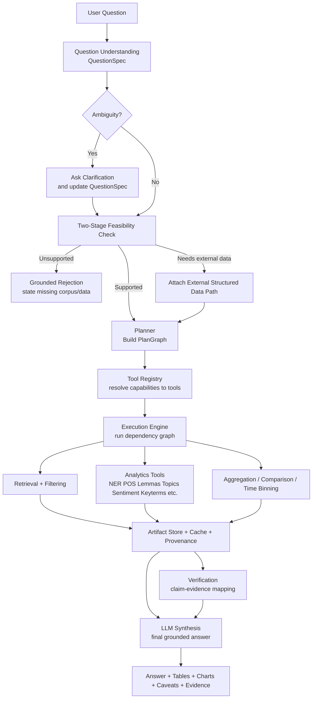
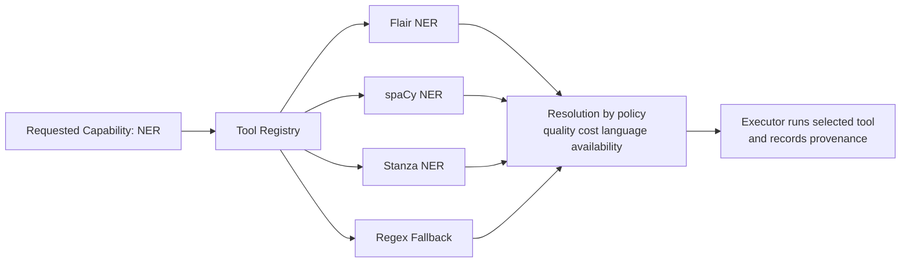

# CorpusAgent2 Reframe: General Tool-Orchestrating Analytical Chatbot

## 1. Revised research question section

### Main research question
How can a corpus-agnostic analytical chatbot automatically decompose complex natural-language questions, decide whether clarification is needed, select and orchestrate the right retrieval, NLP, statistical, and verification tools, and produce grounded, traceable answers over large document collections?

### Sub-questions
- **RQ1 — Planning:** How reliably can the system map open-ended analytical questions to executable plans containing clarification, feasibility checks, retrieval strategy, tool selection, grouping dimensions, and output types?
- **RQ2 — Tool orchestration:** Which combinations of interchangeable retrieval and NLP tools best support question classes such as comparison, temporal analysis, actor analysis, framing analysis, distribution analysis, and evidence discovery?
- **RQ3 — Grounding and auditability:** How should intermediate artifacts, provenance, and claim-to-evidence links be stored so that final answers remain inspectable, reproducible, and verifiable?
- **RQ4 — Runtime decision quality:** When should the system answer directly, ask a clarification question, use cached/precomputed analytics, or reject a question as unsupported by the corpus or missing metadata?

### Thesis positioning
This project should no longer be framed mainly as "comparing against CorpusAgent1." That comparison can remain a baseline or historical motivation, but the core contribution is a **general analytical chatbot framework** that can answer many classes of complex corpus questions by planning over interchangeable tools.

### Scientific claim
A defensible claim is:

> A typed, auditable planning-and-execution framework with interchangeable tools can answer complex corpus questions more robustly and inspectably than a hardcoded or heavily LLM-dependent pipeline, while exposing intermediate evidence and failure points.

---

## 2. Benchmark question catalog

The benchmark must cover question classes, not just topics. Each benchmark question should have:
- user question
- optional clarification question
- feasibility conditions
- required metadata
- candidate tools
- expected intermediate artifacts
- expected answer type
- gold evidence or at least gold-supporting article sets

### A. Distribution / descriptive analytics

#### Q1. What is the distribution of nouns in football reports?
- Clarify corpus slice: outlet(s), date range, football-only filter.
- Retrieve football articles.
- Run tokenization, POS tagging, lemmatization.
- Extract nouns.
- Compute frequency distribution and normalized rates.
- Optionally compare across outlets or time bins.
- Return tables + chart + textual interpretation.

#### Q2. Which named entities dominate climate coverage in Swiss newspapers, and how did that change over time?
- Retrieve climate articles.
- Run NER.
- Aggregate entity frequencies by time bin and outlet.
- Detect rising/falling entity prominence.
- Return ranked entities and trend summary.

### B. Comparative media analysis

#### Q3. How does NZZ vs Tages-Anzeiger report on football differently?
- Retrieve comparable slices.
- Run keyphrase extraction, topic modeling, noun/adjective frequency analysis.
- Compare topic emphasis, framing vocabulary, and entity focus.
- Return comparative summary with evidence snippets.

#### Q4. How do newspaper X and Y differ in their coverage of climate change?
- Retrieve climate-related documents from both outlets.
- Run topics, keyterms, NER, optionally sentiment/framing proxies.
- Compare theme emphasis, quoted actors, lexical fields, and time evolution.
- Return structured comparison.

### C. Temporal framing / narrative shift

#### Q5. How did the portrayal of the American president change in Republican media from 2015 to 2018?
- Clarify which outlets count as Republican-aligned.
- Retrieve documents mentioning the president.
- Run entity-linked sentiment/framing extraction, adjective/dependency patterns, topic changes.
- Aggregate by year.
- Return narrative shift with evidence.

#### Q6. How did the framing of AI shift from innovation to risk/regulation across major Swiss newspapers between 2022 and 2026?
- Retrieve AI-related articles.
- Track topics, keyphrases, entities, and burst periods.
- Compare phrase families: innovation/productivity vs risk/regulation.
- Return shift points and outlet differences.

### D. Prediction / evidence discovery

#### Q7. Which media predicted the outbreak of the Ukraine war in 2022?
- Clarify meaning of "predicted".
- Retrieve pre-invasion articles only.
- Search for predictive claims using lexical + semantic retrieval.
- Rank explicitness of claim wording.
- Return ranked evidence table with dates and excerpts.

#### Q8. Which actors dominated the public discourse on housing affordability, and how did this change over time?
- Retrieve housing-affordability articles.
- Run NER and source/quote attribution if available.
- Aggregate actors by time and outlet.
- Return actor dominance analysis.

### E. Metadata-conditional / feasibility-sensitive

#### Q9. Is there a difference in how Ronaldo is portrayed by male vs female journalists?
- Check whether author metadata exists and whether gender inference is allowed or already available.
- If metadata is insufficient, say so early.
- Otherwise retrieve Ronaldo articles, group by author metadata, compare tone/topics/adjectives.
- Return answer with metadata caveat.

#### Q10. How did the perceived value of Ronaldo vs Messi evolve over time?
- Clarify whether value means transfer-market, sporting quality, media sentiment, or brand value.
- Route to corpus-only or corpus+external-data workflow.
- Return comparison with explicit definition of value.

### F. Corpus + external structured data questions

#### Q11. How did the oil price change in America, and how did US media explain it?
- Clarify whether factual market series, media explanation, or both are requested.
- If both: combine structured price data with corpus retrieval.
- Run temporal alignment, event detection, and explanation synthesis.
- Return factual series plus discourse interpretation.

#### Q12. Did media coverage of a company crisis focus more on financial consequences or leadership blame, and how did that balance change over time?
- Retrieve crisis-related articles.
- Use topic/keyphrase/framing lexicons or classifiers.
- Compute finance vs accountability emphasis over time.
- Return trend and examples.

---

## 3. Architecture proposal

### Core design principle
Stop building a script chain that assumes one fixed question path. Build a **question-to-plan-to-execution graph**.

### New framework layers

#### Layer 0 — User question + conversation context
- raw question
- prior clarification turns
- corpus target
- optional user constraints

#### Layer 1 — Question understanding
Outputs a typed `QuestionSpec`:
- question class
- intent
- entities
- time range
- comparison dimensions
- granularity
- expected output type
- ambiguity flags
- feasibility hypotheses

#### Layer 2 — Clarification and feasibility
Two-stage feasibility:
1. metadata/schema feasibility
2. lightweight retrieval-backed feasibility

Possible outcomes:
- answerable as-is
- answerable after clarification
- answerable only with external structured data
- not answerable from current corpus/metadata

#### Layer 3 — Planner
Generates an executable `PlanGraph`:
- retrieval node(s)
- filter node(s)
- analysis node(s)
- aggregation node(s)
- verification node(s)
- synthesis node

The planner should choose tools by capability tags, not hardcoded library names.

#### Layer 4 — Tool registry
Every tool is registered with typed metadata:
- `tool_name`
- `provider` (spacy, textacy, stanza, nltk, gensim, flair, textblob, internal)
- `capabilities`
- `input_schema`
- `output_schema`
- `requirements`
- `cost_class`
- `deterministic`
- `languages_supported`
- `batchable`
- `cache_key_fn`

#### Layer 5 — Execution engine
- resolves dependency graph
- executes nodes in order or parallel
- caches outputs
- materializes artifacts
- records provenance
- handles fallback chains

#### Layer 6 — Evidence and verification
- claim extraction from draft answer
- support lookup against retrieved evidence
- contradiction / neutral / supported verdicts
- evidence links stored per claim

#### Layer 7 — Final synthesis
The LLM is used here, not as the whole system:
- summarize retrieved evidence
- explain intermediate analytics
- state caveats and uncertainty
- produce text + chart/table references

### Why this is the right shift
The current repo already shows staged execution, provenance, retrieval assets, and some verification machinery. But it is still a stage-centric prototype with partial analytics completion and documentation inconsistencies. The new framework should preserve the deterministic backend while moving the runtime logic to a task-centric plan graph. fileciteturn2file13 fileciteturn2file14

### Interchangeable tool design
Do not bind the framework to a single library. Bind it to **capabilities**.

Examples:
- `tokenize`, `sentence_split`, `pos_tag`, `lemmatize`, `dependency_parse`, `ner`, `keyterms`, `noun_phrases`, `triples`, `topic_model`, `sentiment`, `similarity`, `readability`, `lexical_diversity`, `classify`, `entity_link`, `embed_documents`, `embed_query`

Then map providers:
- spaCy: tokenize, sentence_split, pos_tag, morphology, lemmatize, dependency_parse, ner, classify, entity_link, vectors
- textacy: cleaning, normalization, extraction, topic workflow, readability, lexical diversity
- Stanza: tokenize, MWT, lemmatize, POS, morphology, dependency_parse, ner
- NLTK: corpora, tokenization utils, tagging, parsing, classical experimentation
- gensim: tfidf, lsi, lda, hdp, embeddings, phrase detection, similarity/indexing
- Flair: sequence labeling, text classification, embeddings
- TextBlob: noun phrases, sentiment, simple classification

The planner chooses **capabilities**, the registry resolves the concrete tool implementation.

### Runtime policy
- Prefer deterministic / cheap tools first for broad corpus passes.
- Use heavier neural tools when the question actually needs them.
- Use precomputed analytics when available.
- Avoid running topic models or expensive embeddings at query time over huge corpora unless cached slices exist.

### Data model additions

#### `QuestionSpec`
```json
{
  "question_id": "uuid",
  "user_question": "How does NZZ vs TA report on football differently?",
  "question_class": "comparative_media_analysis",
  "needs_clarification": false,
  "entities": ["NZZ", "Tages-Anzeiger", "football"],
  "time_range": null,
  "group_by": ["outlet"],
  "required_capabilities": ["retrieve", "keyterms", "topic_model", "ner", "aggregate", "synthesize"],
  "output_types": ["table", "narrative"],
  "metadata_requirements": ["outlet", "date"],
  "feasibility_status": "likely"
}
```

#### `PlanGraph`
```json
{
  "plan_id": "uuid",
  "nodes": [
    {"id": "r1", "type": "retrieve", "capability": "hybrid_retrieval"},
    {"id": "f1", "type": "filter", "depends_on": ["r1"]},
    {"id": "a1", "type": "analyze", "capability": "keyterms", "depends_on": ["f1"]},
    {"id": "a2", "type": "analyze", "capability": "topic_model", "depends_on": ["f1"]},
    {"id": "a3", "type": "analyze", "capability": "ner", "depends_on": ["f1"]},
    {"id": "g1", "type": "aggregate", "depends_on": ["a1", "a2", "a3"]},
    {"id": "v1", "type": "verify", "depends_on": ["g1"]},
    {"id": "s1", "type": "synthesize", "depends_on": ["g1", "v1"]}
  ]
}
```

#### `RunManifest`
- question spec snapshot
- resolved plan graph
- tool versions
- corpus slice hashes
- artifact paths
- evidence mappings
- claim verdicts
- timings and failures

---

## 4. Prioritized implementation roadmap

### Phase 1 — Stop the current mess
1. Fix naming mismatches immediately.
   - If lexical retrieval is TF-IDF, stop calling it BM25 in code, artifacts, and thesis text.
2. Reconcile reproducibility drift.
   - Align `README.md`, `pyproject.toml`, scripts, and environment files on one Python version.
3. Regenerate one clean end-to-end run.
   - Produce one trustworthy reference run with logs and manifest.

Why first: right now the repo still shows partial implementation and credibility-damaging inconsistencies. fileciteturn2file9 fileciteturn2file14

### Phase 2 — Introduce the planning abstraction
1. Add `QuestionSpec` and `PlanGraph` schemas.
2. Build a small deterministic planner first.
   - rule/template based by question class
   - only later optionally add an LLM planner under schema constraints
3. Add two-stage feasibility.
4. Separate planning from execution.

Why: this is the main architectural leap from stage scripts to a general chatbot. The prior thesis explicitly points to a better two-stage feasibility design and domain-agnostic applicability. fileciteturn2file16

### Phase 3 — Build interchangeable tool registry
1. Create capability taxonomy.
2. Wrap all existing tools under a common interface.
3. Add fallback chains.
   - example: `ner -> flair | spacy | stanza | regex_fallback`
4. Record all tool resolutions in provenance.

Why: otherwise your "general tool choosing chatbot" claim is fake.

### Phase 4 — Upgrade runtime to task graph execution
1. Convert current stage functions into reusable task functions.
2. Executor resolves a `PlanGraph` rather than calling `scripts/00-07` logic directly.
3. Add cache layer per artifact hash.
4. Add failure recovery and partial-completion behavior.

### Phase 5 — Strengthen evidence, verification, and outputs
1. Store claim-to-evidence links.
2. Add answer sections: findings, evidence, caveats, unsupported parts.
3. Verify answer claims against retrieved evidence.
4. Add tables/plot artifacts that final synthesis can reference.

### Phase 6 — Evaluation worth defending
1. Expand benchmark questions to 12–20 across classes.
2. Build gold relevance/evidence labels.
3. Evaluate:
   - planning correctness
   - clarification correctness
   - feasibility correctness
   - retrieval quality
   - answer faithfulness
   - tool-selection accuracy
   - runtime / latency / cost
4. Run ablations with adequate sample sizes.

The current repo evidence is still too thin for strong scientific claims, especially for evaluation breadth and complete analytics execution. fileciteturn2file14 fileciteturn2file17

---

## 5. Flowchart of the new framework



### Tool interchangeability sub-flow



---

## 6. Concrete advice for fixing the current codebase

### What is wrong right now
- The repo is still framed too much as a deterministic staged prototype rather than a general question-driven system.
- Retrieval naming is scientifically sloppy: TF-IDF is labeled BM25 in some outputs.
- NLP tooling evidence is partial/incomplete.
- Evaluation sets are too small for strong claims.
- Reproducibility docs are inconsistent.
- Tool exposure via MCP is promising but not yet the actual core framework abstraction. fileciteturn2file9 fileciteturn2file14 fileciteturn2file15

### What to keep
- deterministic backend stages
- provenance module
- retrieval/evaluation scaffolding
- faithfulness module
- Slurm/offline precompute mindset

### What to replace or refactor
- replace hardcoded stage assumptions with plan graph execution
- replace library-specific calls inside business logic with registry-based capability calls
- replace binary feasibility-only LLM gate with two-stage feasibility
- replace ad hoc output files with canonical run manifests and artifact contracts

---

## 7. Codex prompt to revise the existing codebase

```text
You are revising an existing Python project called corpusagent2.

Your job is NOT to rebuild everything blindly and NOT to produce toy abstractions. Your goal is to refactor the current stage-centric prototype into a general analytical chatbot framework that can answer many classes of complex corpus questions by planning which tools to use.

## Core goal
The framework must accept open natural-language questions about a corpus and decide:
1. what type of question it is,
2. whether clarification is needed,
3. whether the question is feasible with current corpus + metadata,
4. what retrieval, NLP, aggregation, and verification tools are needed,
5. how to execute them through a common interchangeable tool interface,
6. how to synthesize a grounded final answer with provenance and evidence links.

The current repo already contains useful pieces for retrieval, faithfulness, provenance, MCP wrapping, and staged scripts. Reuse existing working logic where possible, but redesign the runtime architecture around typed planning and interchangeable tools.

## Hard constraints
- Do not invent capabilities not supported by code or clearly mark them as TODO.
- Preserve existing working retrieval, provenance, and faithfulness logic where possible.
- Make tool integrations interchangeable via a capability registry.
- Keep the system auditable and deterministic where possible.
- Prefer explicit schemas and dataclasses / pydantic models over vague dict soup.
- Do not leave naming lies in place. If current lexical retrieval is TF-IDF, rename all BM25 labels unless a real BM25 backend is implemented.
- Keep compatibility with existing outputs if reasonable, but prioritize architectural correctness.

## Target architecture
Implement the following new abstractions:

### 1. QuestionSpec
A typed object representing parsed question intent:
- question_id
- raw_question
- normalized_question
- question_class
- ambiguity_flags
- clarification_question (optional)
- entities
- time_range
- group_by
- required_capabilities
- metadata_requirements
- expected_output_types
- feasibility_status

### 2. PlanGraph
A typed execution graph with nodes such as:
- retrieve
- filter
- analyze
- aggregate
- verify
- synthesize

Each node must have:
- node_id
- node_type
- capability
- params
- dependencies
- output_key

### 3. Tool registry
Create a registry where each tool advertises:
- tool_name
- provider
- capabilities
- input_schema
- output_schema
- requirements
- cost_class
- deterministic
- languages_supported
- priority
- fallback_of (optional)

The planner must choose capabilities, and the registry must resolve concrete tools.

### 4. Execution engine
Build an executor that:
- resolves PlanGraph dependencies,
- calls tools through the registry,
- caches outputs,
- stores artifacts,
- records provenance,
- supports partial completion and structured failures.

### 5. Two-stage feasibility
Implement:
- metadata/schema feasibility
- lightweight retrieval-backed feasibility

The system should not rely on a single LLM yes/no guess.

### 6. Final answer contract
The answer payload should include:
- answer_text
- evidence_items
- artifacts_used
- unsupported_parts
- caveats
- claim_verdicts

## Tool capabilities to support
Use capability-based abstraction, not library-specific business logic.

Available libraries/capabilities already intended in the project:
- spaCy: tokenization, sentence segmentation, POS tagging, morphology, lemmatization, dependency parsing, NER, text classification, entity linking, vectors/similarity
- textacy: cleaning, normalization, exploration, extraction, keyterms, n-grams, acronyms, SVO triples, topic workflow, readability, lexical diversity
- Stanza: tokenization, MWT, lemmatization, POS, morphology, dependency parsing, NER
- NLTK: corpora, tokenization, tagging, parsing, classical classification utilities
- gensim: TF-IDF, LSI, LDA, HDP, embeddings, phrase detection, similarity/indexing
- Flair: sequence labeling, classification, embeddings
- TextBlob: POS tagging, noun phrase extraction, sentiment, simple classification

Create provider adapters so these can be swapped behind common capabilities.

## Required deliverables in code
1. New module(s) for schemas/models:
   - question_spec.py
   - plan_graph.py
   - tool_registry.py
2. A planner module that maps question classes to PlanGraph templates.
3. A capability-based adapter layer for tool providers.
4. An execution engine module.
5. A canonical run manifest structure.
6. Refactored framework entrypoint using the new abstractions.
7. At least one example benchmark config with 10–12 question specs.
8. Tests for:
   - planner outputs
   - tool resolution
   - executor dependency handling
   - provenance capture
   - feasibility behavior

## Refactor guidance
- Reuse current retrieval.py, faithfulness.py, provenance.py where valid.
- Extract current script logic into reusable functions instead of leaving logic only in numbered scripts.
- Introduce a clean separation between offline precompute tasks and query-time execution.
- Maintain MCP compatibility, but MCP is only an interface layer, not the core architecture.

## Important behavior rules
- Ask clarification only when ambiguity changes the required workflow or output materially.
- Reject only when the corpus or metadata genuinely cannot support the question.
- Prefer cheaper deterministic tools first when they are sufficient.
- Record exactly which tool implementation was selected and why.
- Keep answers grounded in retrieved evidence and intermediate artifacts.

## Output format for your work
Provide:
1. a concise refactor plan,
2. the list of files to create/modify,
3. the actual code patches,
4. notes on migration risks,
5. a short example showing a question flowing through QuestionSpec -> PlanGraph -> execution -> grounded answer.

Be ruthless about weak abstractions. Do not produce decorative architecture. Produce code that can actually replace the current runtime structure.
```

---

## 8. Blunt verdict

Your old framing was too small. A "less LLM-heavy CorpusAgent1" is not enough. The stronger project is a general question-driven corpus analysis chatbot with typed planning, interchangeable tools, auditable execution, and grounded synthesis.

That is actually master-level. The rest is just plumbing.

