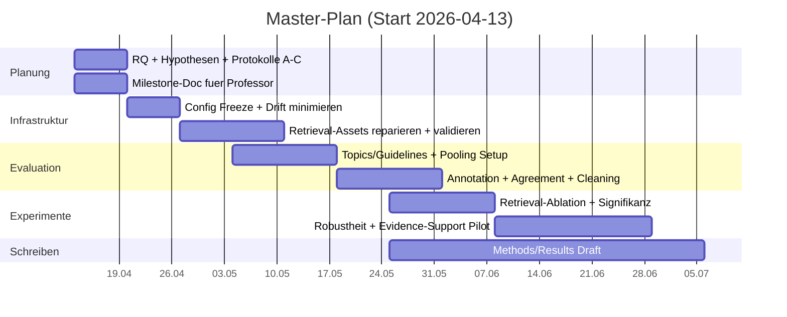
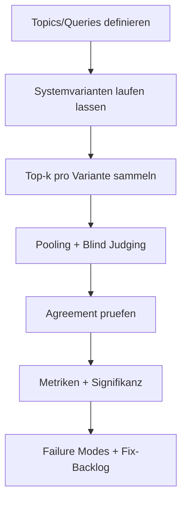

# Projektstatus und wissenschaftliche Next Steps fuer CorpusAgent2

*Datei-Download (Markdown):* [corpusagent2_status_report_2026-04-13.md](sandbox:/mnt/data/corpusagent2_status_report_2026-04-13.md)

## Executive Summary

Du hast nicht „nichts“ getan. Du hast bereits viel Engineering geliefert: grosse Datenpipeline, Docker-Stack, Agent-Runtime, API, Frontend und eine solide Test-Suite. Das ist ein realer Fortschritt. Der wissenschaftliche Teil ist aber noch nicht auf Master-Niveau, weil er im aktuellen Snapshot nicht als **messbarer Beitrag** sichtbar ist: keine saubere Forschungsfrage/Hypothesen-Kette, keine belastbare Evaluation ohne Referenzantworten, und ein Benchmark-Setup, das aktuell zu klein ist, um serioese Claims zu tragen. fileciteturn0file0

Wenn du naechste Woche nur „System gebaut“ sagst, wird das (zu Recht) als wissenschaftlich duenn bewertet. Du musst stattdessen zeigen: **(i)** welche Hypothesen du testest, **(ii)** wie du ohne Beispielantworten evaluierst (Relevanzjudgements, Evidence-Support, metamorphische Robustheit), **(iii)** welche Baselines/Ablationen du vergleichst, **(iv)** welcher Zeitplan/Deliverables in 6–12 Wochen realistisch sind. Das ist etablierte Praxis in IR-Evaluation (inklusive Pooling, Agreement und topic-wise Statistik). citeturn6view2turn6view0turn2view2turn2view0

Der groesste Status-Blocker fuer serioese Experimente: „Hybrid Retrieval“ (dense+lexical) ist in deinem Snapshot nicht end-to-end real (0 Embeddings in Postgres; lokale Retrieval-Artefakte fehlen bzw. sind inkonsistent). Solange du das nicht reparierst oder bewusst *nicht* als Claim nutzt, kannst du keine fairen Ablations-Experimente machen. fileciteturn0file0

## Status quo und Gap-Analyse aus dem Snapshot 2026-04-13

**Was belastbar da ist**  
Das Korpus ist gross und produktiv geladen: 624.095 Dokumente liegen sowohl in Postgres als auch in OpenSearch. fileciteturn0file0  
Die neuere Agent-Runtime (FastAPI Backend + UI) ist die am weitesten entwickelte Betriebsart und laeuft in diesem Snapshot bereits, inklusive Persistenz von Runs/Artefakten und einer breiten Capability-Liste. fileciteturn0file0  
Die Testabdeckung ist fuer ein Forschungssystem gut: `pytest -q tests` ist gruen (71 passed, 1 skipped). fileciteturn0file0  

**Was du als „aktuellen Ist-Zustand“ ehrlich so sagen solltest**  
Trotz TOML/README-Sprache ist die effektive Retrieval-Realitaet im Snapshot in erster Linie: lexikalische OpenSearch-Suche + Postgres-Fetch + (optionaler) Rerank/Analyse-Nodes. Dense Retrieval ist end-to-end nicht operational. fileciteturn0file0  

**Was aktuell wissenschaftlich toxisch ist, wenn du es behauptest**  
- Dense Retrieval/pgvector: Postgres hat 0 gefuellte dense embeddings und keinen Vektorindex; damit ist dense DB-Retrieval inaktiv. fileciteturn0file0  
- Lokales dense Artefakt: `.npy` existiert, ist aber praktisch grossflaechig Null und ohne Doc-ID-Mapping; das ist kein „fertiger Index“. fileciteturn0file0  
- Lexical TF-IDF lokal: erforderliche Assets fehlen; das bricht `main.py` und den MCP-Server. fileciteturn0file0  
- Evaluation: vorhandene Benchmarks/Goldsets sind winzig; das reicht fuer Master-Claims nicht. fileciteturn0file0  

**Warum deine Aussage „ich habe noch nichts wissenschaftlich“ teilweise stimmt (und wie du sie drehst)**  
Relevanzurteile variieren stark zwischen Personen; trotzdem kann man Retrieval-Systeme stabil vergleichen, wenn man sauber arbeitet (Guidelines, Agreement, robuste Metriken, topic-wise Statistik). citeturn6view1turn3view2turn3view3turn2view2  
Das ist genau deine Chance: Du positionierst deinen wissenschaftlichen Beitrag als **test-oracle-freies Evaluationsframework** fuer „evidence-first“ Agenten (Dokumentrelevanz statt Antwort-Keys). Pooling ist dabei Standard, aber mit Annahmen und nachgewiesenen Bias-Grenzen, die du explizit als Limitation reporten musst. citeturn6view0turn6view2

## Assessment-Checkliste und Definition „wissenschaftlicher Beitrag“

**Definition (konkret, professor-tauglich)**  
In deinem Setting zaehlt als wissenschaftlicher Beitrag, wenn du generalisierbar zeigen kannst, dass eine Designentscheidung (z.B. Retrieval-Variante, Reranker, Evidence-Table-Design, Planner-Policy) unter kontrollierten Bedingungen messbar wirkt, und du diese Wirkung mit Protokoll, Statistik, Fehleranalyse und Limitationen belegst. Relevanzjudgements sind dafuer ein etabliertes Laborinstrument. citeturn6view0turn6view1turn2view0

**Brutal ehrliche Checkliste**  
Wenn du bei mehreren Punkten „nein“ sagst, ist es noch kein Master-Level Projektteil, sondern nur ein Softwareprojekt:

| Achse | Master-ready Kriterium | Nachweis (Artefakt) |
|---|---|---|
| Forschungsfrage | in 2 Saetzen testbar und scoped | 1 Seite RQ + Scope |
| Hypothesen | 2–3 falsifizierbar, mit erwarteter Richtung | H1–H3 + Messgroessen |
| Baselines/Ablation | Varianten sind explizit und fair vergleichbar | Variantentabelle + Config Freeze |
| Evaluation ohne Antworten | mind. 3 Methoden ohne Referenzantworten | Protokolle A–C (siehe unten) |
| Relevanz-Judging | Guidelines + Blindness + Agreement | Guideline + Agreement-Report |
| Statistik | topic-wise Signifikanz oder Resampling | Notebook + Testwahl/Begruendung |
| Reproduzierbarkeit | Runs sind wiederholbar (Seeds/Logs/Artefakte) | Repro-Skript + Run-IDs |

**Kurzform, die du dem Professor sagen kannst**  
„Ich evaluiere ein evidence-first Agentensystem ohne Referenzantworten ueber (A) IR-Relevanzjudgements mit Pooling, (B) Claim->Evidence Support Labels, (C) metamorphische Robustheitstests; Ergebnisse sind replizierbar und statistisch begruendet.“ citeturn6view2turn6view0turn0search3turn2view2

## Naechste Schritte, Milestones und Zeitplan

**Naechste Schritte (3–5 konkrete Dinge, nicht mehr)**

| Schritt | Warum das sinnvoll ist | Aufwand (realistisch) | Output fuer Professor |
|---|---|---:|---|
| Betriebsmodus festnageln (lexical-only *oder* echtes hybrid) | Ohne Zielarchitektur keine fairen Experimente | 4–8 h | 1 Seite Entscheidung + Config Freeze |
| Retrieval-Artefakte reparieren + Validierung | Ohne Retrieval-Integritaet sind spaetere Resultate wertlos | 1–2 Wochen | Validationsreport + Smoke Bench |
| Eval-Set v1 bauen (50–100 Topics) + Guidelines | Mini-Sets tragen keine wissenschaftlichen Claims | 1–2 Wochen | Topic-Sheet + Pooling/Label Schema |
| Experiment A (Retrieval) laufen + Statistik | Erstes hartes Ergebnis mit Metriken | 1 Woche | nDCG/MAP/Recall + Signifikanz + Error Cases |
| Experimente B/C pilotieren | Zeigt Oracle-freie Methodenvielfalt | 3–5 Tage | Support-Labels + Robustheitsmetriken |

Damit dein Vergleich nicht self-deception ist: Pooling, Judging, Agreement und Signifikanz sind nicht „nice to have“, sondern die Mindesthygiene, damit Resultate wissenschaftlich verteidigbar sind. citeturn6view0turn3view2turn2view2

**Milestones mit Daten (6–12 Wochen ab 2026-04-13)**

| Datum | Milestone | Deliverables | Akzeptanzkriterium |
|---|---|---|---|
| 2026-04-20 | Evaluationsdesign steht | 2–3 Seiten: RQ/Hypothesen, A–C Protokolle, Risiken | „Messbar“ abgenickt |
| 2026-04-27 | Config Freeze + Repro-Basis | Fixierte Configs, Run-Logging, 1 End-to-end Run | Dritter kann nachlaufen |
| 2026-05-11 | Eval-Set v1 + Annotation Start | 50 Topics, Pooling Setup, Guidelines | 2 Rater starten blind |
| 2026-05-25 | Erste Resultate (Experiment A) | nDCG/MAP/Recall + Signifikanz + Error Analysis | >=2 Varianten fair verglichen |
| 2026-06-15 | Robustheit + Evidence-Support Pilot | Metamorphik + Support-Labels (Pilot) | 1 klarer Befund + Failure Set |
| 2026-07-06 | Konsolidierter Zwischenbericht | 8–12 Seiten Draft + Repro-Paket | paper-like Struktur |

Signifikanztests im IR-Kontext sollten bewusst gewaehlt werden; die CIKM-Studie zu Signifikanztests in IR-Evaluations vergleicht u.a. t-test, Randomization/Permutation und warnt vor schwachen Tests. citeturn2view2

**Ressourcenbedarf (damit du dich nicht selbst anluegst)**

| Ressource | Minimal | Solide | Hinweis |
|---|---:|---:|---|
| Topics | 30 | 50–100 | fuer Statistik besser >50 |
| Annotatoren | 1 | 2 | Agreement braucht >=2 citeturn3view2turn3view3 |
| Pooltiefe (Docs/Topic) | 10–20 | 20–50 | Pooling-Trade-off transparent citeturn6view0 |
| Nutzerstudie (optional) | 4–6 Personen | 8–12 Personen | process metrics, nicht „Answer Key“ citeturn3view1turn2view5 |

## Experimente/Testmethoden ohne Referenzantworten

**Ueberblick: 3 Kernmethoden (plus optional Nutzerstudie)**  
Die Auswahl ist absichtlich so gebaut, dass sie ohne Antwort-Goldens auskommt, aber dennoch messbar und verteidigbar ist.

| Experiment | Protokoll-Kern | Daten | Metriken | Kontrollen | Typische Pitfalls |
|---|---|---|---|---|---|
| A: IR-Relevanzjudgements (Pooling) | Pool bilden, blind urteilen, Metriken + Statistik | Topics, Pooldocs, Labels | nDCG@k, MAP, Recall@k | gleiche Topics, gleiche Pooltiefe | Pooling-Bias, Judging-Varianz citeturn6view0turn6view1 |
| B: Claim->Evidence Support | Claims labeln gegen eigene Zitate/Snippets | Systemoutputs, Snippets | Support-, Unsupported-Rate | Snippet-Regeln, Blindness | Cherry-picking, unklare Claims |
| C: Metamorphische Robustheit | Query-Transformationen und Invarianten testen | Query-Set, Transformations | Stability, Rank Corr, Compliance | Seeds/Settings fix | MRs falsch definiert citeturn0search3turn0search7 |
| D (optional): Nutzerstudie | Tasks, Vergleich V0 vs V1, process metrics | Teilnehmende, Aufgaben | Zeit, Erfolg, Workload | Counterbalancing | kleines N, Bias citeturn3view1turn2view5 |

**Experiment A (Protokoll, Daten, Metriken, Controls, Pitfalls)**  
- Daten: 50–100 Topics; pro Topic gepoolte Dokumentmenge (Union Top-k ueber Varianten). Pooling wird genutzt, weil vollstaendige Judgements zu teuer sind. citeturn6view0turn6view2  
- Protokoll: Blind Judging mit TREC-aehnlicher Arbeitsdefinition (relevant, wenn du es in einem Report verwendest). Diese Definition wird u.a. in TREC-Richtlinien von entity["organization","National Institute of Standards and Technology","us standards agency"] verwendet. citeturn6view2  
- Metriken: nDCG@k (graded relevance) + MAP/Recall; nDCG ist fuer solche Rankings etabliert. citeturn2view0  
- Controls: gleiche Topics, gleiche Pooltiefe, fixierte Configs/Seeds, gleiche Judging-Guidelines.  
- Pitfalls: Pooling-Bias (unjudged als nicht relevant), Judging-Varianz; beides explizit berichten und ggf. Sensitivitaetsanalyse zur Pooltiefe. citeturn6view0turn6view1  
- Statistik: topic-wise Tests (Permutation/Randomization oder t-test) und saubere Begruendung der Testwahl. citeturn2view2  

**Experiment B (Protokoll, Daten, Metriken, Controls, Pitfalls)**  
- Daten: Systemantwort plus Evidence Table/Zitate (deine Runtime persistiert Artefakte bereits). fileciteturn0file0  
- Protokoll: Rater labeln pro Claim `SUPPORTED / NOT SUPPORTED / UNCLEAR`, ausschliesslich gegen zitierte Snippets.  
- Metriken: Support-Rate, Unsupported-Rate, Unclear-Rate; optional nach Claim-Typ.  
- Controls: identische Snippet-Regeln, Blindness ueber Systemvarianten, klare „Claim“-Definition (z.B. 1 Aussage pro Satz).  
- Pitfalls: Cherry-picking ueber Snippets; unklare Claims; und wenn Retrieval schwach ist, werden alle Varianten schlecht aussehen (deshalb erst Retrieval stabilisieren). fileciteturn0file0  

**Experiment C (Protokoll, Daten, Metriken, Controls, Pitfalls)**  
Metamorphic Testing adressiert explizit das fehlende „test oracle“ Problem; du testest Invarianten statt Ground Truth. citeturn0search3turn0search7  
- Daten: Baseline-Query-Set (z.B. 50) plus Transformationen (Paraphrase, Constraint Tightening, Entity Swap, Noise).  
- Metriken: Stability (Jaccard@k), Rank Corr (Spearman/Kendall), Constraint-Compliance, Failure Rate.  
- Controls: gleiche Seeds/LLM-Settings, gleiche Retrievaltiefe, gleiche Systemvariante.  
- Pitfalls: falsch definierte Invarianten (MRs muessen fachlich begruendet sein); Stochastik kann Metriken verfaelschen (deshalb Settings einfrieren).  

## Artefakte fuer den Professor, Risikoanalyse, Templates

**Artefakte (was du konkret vorlegen solltest)**  
- Experiment Registry (1 Markdown pro Experiment): Ziel, Hypothesen, Variablen, Controls, Metriken, Auswertung, Limitationen.  
- Config Freeze + Hashes pro Variante (sonst ist „Vergleich“ inhaltlich wertlos). fileciteturn0file0  
- Run-IDs/Artefaktpfade als Laborbuch (du hast Run-Persistenz, nutze sie als wissenschaftlichen Vorteil). fileciteturn0file0  
- Annotation Package: Guidelines + Examples + Agreement-Report. Agreement kann z.B. via Krippendorff-Alpha (nach entity["people","Klaus Krippendorff","reliability alpha author"]) oder Kappa nach entity["people","Jacob Cohen","kappa statistic 1960"] berichtet werden. citeturn3view2turn3view3  
- Statistik-Notebook: Metriken, Konfidenzintervalle, Signifikanztests. citeturn2view0turn2view2  
- Data Quality Report fuer Zeit/`published_at` (sonst sind Zeitreihenbehauptungen nicht serioes). fileciteturn0file0  

**Risiken und Mitigation (kurz und hart)**

| Risiko | Was schiefgeht | Mitigation |
|---|---|---|
| Du behauptest hybrid, aber es ist nicht real | Wissenschaftlich falscher Claim | Entweder fixen oder aus Scope streichen fileciteturn0file0 |
| Pooling-Bias | Evaluationsverzerrung | Pool ueber mehrere Systeme, Sensitivitaet zur Tiefe, Limitation reporten citeturn6view0 |
| Subjektive Relevanz zerlegt Metriken | Zahlen sind Rauschen | Guidelines + Blindness + Agreement citeturn3view2turn6view1 |
| Scope Creep | Keine Resultate | Feature-Freeze nach 2026-04-27, nur Experimente |
| Unreife Run-Hygiene | Nicht reproduzierbar | Logging, Run-Finalization, Artefaktpflege fileciteturn0file0 |

**Milestone Submission Template (Bullet List, direkt kopierbar)**  
- Titel/These (1 Satz)  
- Forschungsfrage (2 Saetze)  
- Hypothesen H1–H3 (je 1 Satz)  
- Systemvarianten/Baselines (V0–Vn)  
- Evaluation ohne Referenzantworten (Experiment A–C, je 4–6 Zeilen)  
- Daten & Annotation (Topics, Pooling, Rater, Agreement)  
- Zeitplan bis 2026-07-06 (Milestones + Deliverables)  
- Top-3 Risiken + Mitigation  
- Naechster Schritt bis naechstes Meeting (1 Woche)

**One-Page Slide (Inhalt, keine Design-Spielchen)**  
Titel: „Evaluationsdesign fuer evidence-first Agent ueber News-Korpus ohne Referenzantworten“  
Kernaussage: (A) IR-Judgements+Pooling, (B) Claim->Evidence Support, (C) metamorphische Robustheit, plus optionale Nutzerstudie mit entity["organization","ISO","international standards org"] 9241-11 Outcomes und dem entity["organization","NASA","us space agency"] Task Load Index (NASA-TLX). citeturn3view1turn2view5  
Bottom line: „Ich kann Wirkung messen, auch wenn es keine Gold-Antworten gibt; ich liefere replizierbare Experimente, Statistik und Failure Modes.“