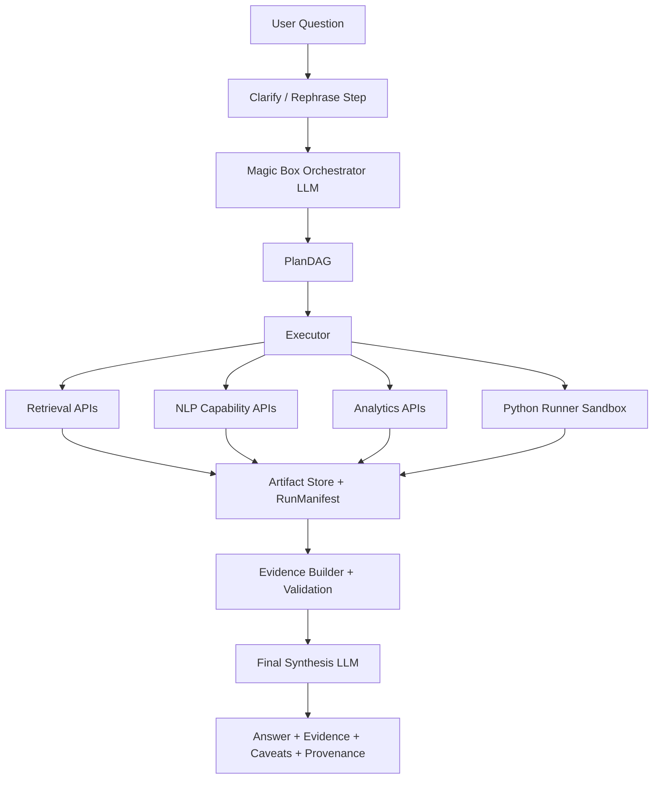

# CorpusAgent2 First-Trial Findings

## Executive conclusion

The professor's direction is clear: do **not** center the project on a rigid upfront `QuestionSpec` gate or on "beating CorpusAgent1". The stronger direction is a **generic, tool-using analytical corpus agent** that:

- accepts hard free-form questions,
- uses a small number of LLM calls for understanding, planning, adaptation, and final synthesis,
- delegates all real computation to tool APIs,
- avoids sending every document through an LLM,
- produces evidence when the question demands it,
- stores provenance and intermediate artifacts,
- runs locally first and can later move to a VM or server.

The right architecture is therefore **not**:

- pure prompt engineering,
- a fully deterministic question-template system,
- or a free-form "LLM does everything" loop.

The right architecture is:

- **LLM-guided orchestration**
- over a **capability-first tool registry**
- with a **stateful PlanDAG**
- backed by **retrieval, analytics, evidence building, provenance, and sandboxed execution**.

## What the original CorpusAgent actually does

Based on the uploaded [CorpusAgent repository](https://github.com/mocatex/corpus-agent) and its `src/pipeline.py` and `src/main.py`:

### What it gets right

- It is genuinely **question-driven** rather than a fixed offline script chain.
- It uses an **LLM-driven loop** to:
  - assess whether a question fits the corpus,
  - plan retrieval,
  - choose analysis steps,
  - reduce the working set,
  - summarize findings.
- It keeps a **temporary per-run working state** in the backend.
- It uses **retrieval first**, not full-corpus LLM reading.
- It exposes an **interactive UI**.

### What is weak in the original version

- Much of the analysis layer is still **mocked** in `src/mocked_tools.py`.
- The orchestration is flexible but still fairly **opaque**.
- Tool selection is not yet a clean **capability registry**.
- The runtime is not built around a clear **parallel execution graph**.
- The Python code-generation path is useful, but not safe enough as a core production story without stronger sandboxing.
- The UI is tightly coupled to **Streamlit**, which is fine for a prototype but not ideal as the architectural center.

### What to keep from CorpusAgent1

- flexible LLM planning,
- working-set reduction,
- retrieval before analysis,
- run-level state and provenance,
- evidence-oriented answers,
- temporary artifact persistence,
- the idea that the agent can adapt when the exact required tool does not exist.

### What to replace or tighten

- mocked analytics -> real capability APIs,
- loose tool selection -> capability-first registry,
- ad hoc sequencing -> `PlanDAG` with parallel branches,
- unsafe code execution -> sandboxed Python runner service,
- Streamlit-as-core -> API-first backend plus optional frontend,
- broad free-form planner output -> structured planner action format.

## Why the current `corpusagent2` runtime is not the right center

The current local `corpusagent2` repo already contains useful backend pieces:

- a capability-oriented [tool_registry.py](/D:/OneDrive%20-%20ZHAW/MSE_school_files/Sem4/VT2/corpusagent2/src/corpusagent2/tool_registry.py),
- a reusable [execution_engine.py](/D:/OneDrive%20-%20ZHAW/MSE_school_files/Sem4/VT2/corpusagent2/src/corpusagent2/execution_engine.py),
- provenance and manifest structures,
- deterministic runtime scaffolding in [framework.py](/D:/OneDrive%20-%20ZHAW/MSE_school_files/Sem4/VT2/corpusagent2/src/corpusagent2/framework.py).

But the current center of gravity is still too deterministic for the professor's preferred framing:

- [planner.py](/D:/OneDrive%20-%20ZHAW/MSE_school_files/Sem4/VT2/corpusagent2/src/corpusagent2/planner.py) is built around a rigid upfront `QuestionSpec` and template mapping.
- [framework.py](/D:/OneDrive%20-%20ZHAW/MSE_school_files/Sem4/VT2/corpusagent2/src/corpusagent2/framework.py) assumes this deterministic planning path as the default runtime.

That does **not** mean those files are useless. It means:

- keep the backend execution/provenance ideas,
- relax the hard planning gate,
- move to a CorpusAgent-style planner LLM that emits a structured `PlanDAG`,
- and keep deterministic logic mainly for:
  - validation,
  - tool resolution,
  - execution,
  - artifact storage,
  - evidence formatting,
  - and safety.

## Constraints from the latest professor discussion

These constraints should drive the first trial:

- Framework must be easy to switch between providers, for example a free OpenAI-compatible API first and OpenAI later.
- Too many clarification turns are bad. After a bounded number of clarifications, the agent should continue with **explicit assumptions**.
- Users should be able to **force an answer** even when ambiguity remains.
- Questions must stay on **observable content**, not hidden motives.
  - Good: "How was X portrayed?"
  - Bad: "Why did journalists want to portray X that way?"
- Evidence must be shown when the question type demands it.
  - Example: Ukraine prediction question should return doc id, outlet, date, excerpt, and a strength score.
- The system should be safe to run in a web application and should not depend on raw local filesystem access from the user side.
- All tools should be exposed as APIs or API-like services.
- Parallel execution should be used when steps are independent.
- MCP is useful as a pattern for tool contracts, but it is not the scientific contribution.

## The "magic box" defined precisely

The magic box should be understood as a **stateful orchestration LLM**, not as a mystical black box.

### It is not

- a full-document reader,
- a fully deterministic planner,
- a free-form chain-of-thought toy,
- or a single yes/no judge of answerability.

### It is

- an LLM that sees:
  - the user question,
  - conversation history,
  - clarification history,
  - the tool capability catalog,
  - corpus metadata schema,
  - current run state,
  - known failures,
  - budget constraints,
  - and already-created artifacts,
- and emits one of a small set of structured actions:
  - `ask_clarification`
  - `accept_with_assumptions`
  - `emit_plan_dag`
  - `revise_plan_after_failure`
  - `final_synthesis`
  - `grounded_rejection`

### Minimal internal state

```json
{
  "run_id": "run_001",
  "question": "Which media predicted the outbreak of the Ukraine war in 2022?",
  "clarifications": [],
  "assumptions": [],
  "force_answer": false,
  "corpus_schema": {
    "metadata_fields": ["doc_id", "title", "body", "outlet", "date", "author"]
  },
  "available_capabilities": ["db_search", "ner", "claim_span_extract", "similarity_index"],
  "artifacts": [],
  "tool_failures": [],
  "budget": {
    "planner_calls_used": 0,
    "planner_calls_max": 6
  }
}
```

### Planner loop policy

1. Rephrase or clarify if ambiguity changes the workflow materially.
2. If clarification is skipped, bounded, or force-answered, add explicit assumptions.
3. Produce a `PlanDAG` over capabilities, not library names.
4. Let the executor resolve concrete backends.
5. If a node fails, either:
   - retry once,
   - replace with a fallback capability backend,
   - or ask the planner to revise the plan.
6. Synthesize only from artifacts and evidence, never from imagined results.

## Recommended first-trial architecture



## Structured planner output without going back to rigid `QuestionSpec`

You do **not** need to keep `QuestionSpec` as a hard external thesis concept. But the planner still needs a structured output format. The clean compromise is:

- no hard `QuestionSpec` gate as the core story,
- but a structured **planner action schema** and **PlanDAG schema** internally.

Example:

```json
{
  "action": "emit_plan_dag",
  "assumptions": ["Interpret 'predicted' as explicit warning of imminent invasion before 2022-02-24."],
  "plan_dag": {
    "nodes": [
      {
        "id": "n1",
        "capability": "db_search",
        "inputs": {
          "query": "Ukraine invasion warning imminent attack troop buildup",
          "date_to": "2022-02-23",
          "top_k": 300
        },
        "depends_on": []
      },
      {
        "id": "n2",
        "capability": "claim_span_extract",
        "inputs": {
          "from_node": "n1"
        },
        "depends_on": ["n1"]
      },
      {
        "id": "n3",
        "capability": "claim_strength_score",
        "inputs": {
          "from_node": "n2"
        },
        "depends_on": ["n2"]
      },
      {
        "id": "n4",
        "capability": "build_evidence_table",
        "inputs": {
          "from_node": "n3"
        },
        "depends_on": ["n3"]
      }
    ]
  }
}
```

This preserves flexibility without turning the runtime into prompt spaghetti.

## Final capability-first tooling API list

The current library list is strong on core annotation but bloated with overlap. The correct move is to deduplicate into **capabilities** and let the registry choose a backend.

### A. Core annotation capabilities

| Capability | Primary backend | Fallbacks | Why it exists |
|---|---|---|---|
| `lang_id` | textacy or Stanza multilingual | none | Route documents to the right language pipeline |
| `clean_normalize` | textacy | lightweight internal cleaner | Text cleanup before annotation |
| `tokenize` | spaCy | Stanza, NLTK | Common token API |
| `sentence_split` | spaCy | Stanza, NLTK | Common sentence API |
| `mwt_expand` | Stanza | none | Multi-word token expansion |
| `pos_morph` | spaCy | Stanza, Flair, NLTK | POS and morphology for noun/adjective/entity-linked analysis |
| `lemmatize` | spaCy | Stanza, TextBlob | Lemma-based aggregation |
| `dependency_parse` | spaCy | Stanza | Needed for SVO, attribution, framing cues |
| `noun_chunks` | spaCy or textacy | none | Useful for noun distribution and phrase extraction |
| `ner` | spaCy | Stanza, Flair | Named entities across multiple question families |
| `entity_link` | spaCy | none | Optional, only if a KB exists |

### B. Extraction and corpus analytics capabilities

| Capability | Primary backend | Fallbacks | Why it exists |
|---|---|---|---|
| `extract_ngrams` | textacy | NLTK | Surface phrase extraction |
| `extract_acronyms` | textacy | none | Abbreviation discovery |
| `extract_keyterms` | textacy | none | Media comparison, framing summaries |
| `extract_svo_triples` | textacy | none | Subject-verb-object relations |
| `topic_model` | textacy | gensim | Topic workflow over retrieved slices |
| `readability_stats` | textacy | none | Optional descriptive analytic |
| `lexical_diversity` | textacy | none | Optional descriptive analytic |

### C. Embeddings and similarity capabilities

| Capability | Primary backend | Fallbacks | Why it exists |
|---|---|---|---|
| `word_embeddings` | gensim | Flair, spaCy vectors | Word-level similarity and lexical neighborhoods |
| `doc_embeddings` | gensim | Flair, spaCy vectors | Dense doc comparison |
| `similarity_pairwise` | spaCy | gensim | Pairwise similarity scoring |
| `similarity_index` | gensim | internal ANN layer later | Semantic retrieval / reranking |

### D. Classification capabilities

| Capability | Primary backend | Fallbacks | Why it exists |
|---|---|---|---|
| `sentiment` | Flair | TextBlob | Cheap framing/tone proxy |
| `text_classify` | Flair | spaCy, TextBlob | Optional supervised classifiers |

### E. Missing capabilities that must be added

These are the real gaps. They matter more than adding yet another NLP library.

| Capability | Why it is required |
|---|---|
| `burst_detect` | Needed for spike and burst questions |
| `claim_span_extract` | Needed for prediction and verification workflows |
| `claim_strength_score` | Needed to rank "how explicit" a prediction or claim is |
| `quote_extract` | Needed for source/voice questions |
| `quote_attribute` | Needed to identify who is being quoted |
| `time_series_aggregate` | Needed for temporal grouping and trend questions |
| `change_point_detect` | Needed for framing-shift or regime-change questions |
| `build_evidence_table` | Needed for evidence-centric outputs |
| `plot_artifact` | Needed when the answer should return a figure |
| `join_external_series` | Needed for corpus + external data questions |

### Duplicates in the original library list

These are real overlaps and should not become separate planner concepts:

- tokenization: spaCy, Stanza, NLTK
- sentence splitting: spaCy, Stanza, NLTK
- POS: spaCy, Stanza, Flair, NLTK, TextBlob
- lemmatization: spaCy, Stanza, TextBlob
- NER: spaCy, Stanza, Flair
- topic modeling: textacy, gensim
- sentiment/classification: Flair, TextBlob, spaCy textcat
- similarity/embeddings: spaCy vectors, gensim, Flair

The planner should never reason in terms of "use spaCy" or "use Flair". It should reason in terms of **capabilities**, and the registry should resolve the backend.

## Coverage of the benchmark questions

The tooling list above is sufficient for the benchmark families if you add the missing analytics and evidence capabilities.

### Directly supported by core annotation + extraction

- Q1 noun distribution
- Q2 entity dominance over time
- Q3/Q4 comparative media analysis
- Q5/Q6 framing and narrative shift
- Q8 actor dominance
- Q12 finance vs blame emphasis

### Supported only if you add the missing capabilities

- Q7 Ukraine prediction question
  - requires `claim_span_extract`, `claim_strength_score`, `build_evidence_table`
- Q4/Q8 quoted actors
  - requires `quote_extract`, `quote_attribute`
- Q6 burst periods
  - requires `burst_detect`
- Q11/Q12 temporal change and alignment
  - requires `time_series_aggregate`, `change_point_detect`, optional `join_external_series`

### Feasibility-sensitive by design

- Q9 journalist-gender question
  - requires metadata coverage and policy clarity
- Q10 Ronaldo vs Messi "value"
  - requires clarification because the answer path changes materially
- Q11 oil-price question
  - often requires external data

## Clarification and assumption policy

This needs to be explicit in the runtime, not just in the thesis text.

### Ask a clarification only when

- the ambiguity changes the required tools,
- the ambiguity changes whether external data is needed,
- the ambiguity changes the answer type,
- or the ambiguity risks a materially wrong answer.

### Do not ask a clarification when

- a reasonable default assumption is safe,
- the user already expressed impatience,
- or the question can still be answered with a caveat.

### Required runtime behavior

- maximum clarification rounds: `2`
- after that:
  - continue with explicit assumptions,
  - log them in provenance,
  - and allow `force_answer=true` to skip further clarifications immediately.

## Evidence policy

Evidence must be returned when the question type is:

- verification,
- prediction,
- contradiction,
- comparative claims,
- strong narrative-change claims,
- or ranked evidence discovery.

Minimal evidence row format:

```json
{
  "doc_id": "12345",
  "outlet": "NZZ",
  "date": "2022-02-10",
  "excerpt": "Western officials warn that a Russian invasion could begin within days...",
  "score": 0.91
}
```

For the Ukraine prediction example, the final answer should contain:

- a ranked evidence table,
- a short synthesis,
- and a caveat that warnings, scenarios, and explicit predictions are not the same thing.

## Safe local-first implementation

### Recommended backend shape

- `FastAPI` backend as the main server
- local libraries wrapped behind API-style modules
- optional simple frontend later
- keep Streamlit only if you want a very fast demo, but not as the core architecture

### Python runner

The Python runner is useful, but it is also the biggest security surface.

For the first trial, the safe local story should be:

- separate service,
- Docker-based execution,
- `--network=none`,
- `--read-only`,
- non-root user,
- CPU / memory / timeout limits,
- writable temp mount only for declared outputs,
- return artifacts as base64 in the response.

This is strong enough for a first local trial and still portable to a server VM later.

### Provider abstraction

To keep model providers swappable:

- use an OpenAI-compatible client abstraction,
- make `base_url`, `api_key`, and `model` configurable,
- do not hardcode OpenAI-specific assumptions into the planner or executor.

That will let you start with a free compatible endpoint and switch later.

## Validation verdict

Scientifically, this architecture is defendable **if** you describe it honestly.

### Defendable claims

- It reduces LLM usage by pushing computation into tools.
- It is more generic than a hardcoded pipeline.
- It is more inspectable than a free-form LLM-only agent loop.
- It supports evidence-bearing answers and explicit rejection.
- It can operate over large corpora without per-document LLM reading.

### Claims you should not make yet

- "It answers anything."
- "It fully solves general analytical QA."
- "It is fully safe because it uses Docker."
- "It is already better than CorpusAgent1 on all dimensions."

### Real scientific contribution

The contribution is the **architecture and runtime policy**:

- LLM-guided planning,
- capability-first tool selection,
- parallel execution,
- evidence-centered outputs,
- and safe local-first deployment.

## Recommended first trial scope

Do not try to solve the whole benchmark in v1.

The best first-trial slice is:

- Q1: noun distribution in football reports
- Q2: named entities dominating climate coverage over time
- Q7: prediction evidence table for the Ukraine war question

Why this is the right slice:

- Q1 validates basic annotation and aggregation.
- Q2 validates time aggregation and entity trends.
- Q7 validates evidence-centric planning, ranking, and output formatting.

If those three work, the architecture is already meaningful.

## Runtime planner prompt shape

You asked what the magic-box prompt should look like. The safest answer is: keep the planner prompt **narrow**, structured, and action-oriented.

### Planner system prompt sketch

```text
You are the orchestration planner for a corpus-analysis agent.

You do not answer the user question directly unless asked to do final synthesis.
You do not read the whole corpus.
You do not choose libraries. You choose capabilities.

Your job is to:
- decide whether clarification is needed,
- make reasonable assumptions when clarification is not worth the cost,
- produce a PlanDAG of tool capabilities,
- revise the plan after tool failures,
- decide when evidence tables are required,
- decide when the system must reject or partially answer.

You will receive:
- user question
- clarification history
- assumptions already made
- available capabilities with short schema summaries
- corpus metadata schema
- current run state
- artifacts already available
- tool failures so far

Rules:
- Ask a clarification only if ambiguity changes the workflow materially.
- After at most 2 clarification turns, continue with explicit assumptions.
- Prefer cheaper deterministic tools before more expensive ones.
- Use parallel branches when capabilities are independent.
- For prediction, verification, and contradiction questions, require evidence output.
- Never infer hidden motives of journalists or actors from corpus text alone.
- If the corpus or metadata cannot support the question, return a grounded rejection.

Return only JSON with one of these actions:
- ask_clarification
- accept_with_assumptions
- emit_plan_dag
- revise_plan_after_failure
- grounded_rejection
- final_synthesis
```

## Codex system prompt for the first implementation trial

Use the following prompt for Codex.

```text
You are Codex implementing a CorpusAgent-style analytical QA framework on large corpora.

Goal:
- Solve complex questions with minimal LLM calls.
- Never send all documents through an LLM.
- Use LLM mainly for planning + final synthesis + limited top-k reasoning.
- All NLP and analytics are executed via capability APIs backed by local libraries.
- Everything runs locally first (developer machine), then can be deployed to a VM.

Hard requirements:
1) Capability-first tool registry
- Create a ToolRegistry where each tool is registered by capability name, not by library name.
- Each capability can have multiple backends (priority order) and a standard input/output schema.
- The planner chooses capabilities only. Concrete backend resolution happens in the registry.

2) Planner style
- Keep CorpusAgent-style flexible planning.
- Do NOT build the core runtime around a rigid QuestionSpec gate.
- The planner LLM sees:
  - tool capability catalog (names + short descriptions + I/O schema summaries)
  - corpus metadata schema
  - current run state
  - clarification history
  - assumptions already made
  - available artifacts
- The planner outputs structured JSON actions:
  - ask_clarification
  - accept_with_assumptions
  - emit_plan_dag
  - revise_plan_after_failure
  - grounded_rejection
  - final_synthesis

3) PlanDAG
- Planner output must support a PlanDAG:
  nodes: {id, capability, inputs, depends_on[]}
- Independent nodes must be executable in parallel.
- Executor must support asyncio-based parallel execution where dependencies allow it.

4) Clarification policy
- Ask clarification only when ambiguity changes workflow or output materially.
- Limit clarification rounds to 2.
- After that, continue with explicit assumptions.
- Support force_answer=true to skip further clarification.
- Log clarifications and assumptions in provenance.

5) Implement these capability APIs as local python modules callable by the executor:

Core annotation:
- lang_id (textacy or Stanza multilingual)
- clean_normalize (textacy)
- tokenize (spaCy primary; fallback Stanza; fallback NLTK)
- sentence_split (spaCy primary; fallback Stanza; fallback NLTK)
- mwt_expand (Stanza)
- pos_morph (spaCy primary; fallback Stanza; fallback Flair; fallback NLTK)
- lemmatize (spaCy primary; fallback Stanza; fallback TextBlob)
- dependency_parse (spaCy primary; fallback Stanza)
- noun_chunks (spaCy/textacy)
- ner (spaCy primary; fallback Stanza; fallback Flair)
- entity_link (spaCy, optional if a KB exists)

Extraction / analytics:
- extract_ngrams (textacy primary; fallback NLTK)
- extract_acronyms (textacy)
- extract_keyterms (textacy)
- extract_svo_triples (textacy)
- topic_model (textacy primary; fallback gensim)
- readability_stats (textacy)
- lexical_diversity (textacy)

Embeddings / similarity:
- word_embeddings (gensim primary; fallback Flair; fallback spaCy vectors)
- doc_embeddings (gensim primary; fallback Flair; fallback spaCy vectors)
- similarity_pairwise (spaCy primary; fallback gensim)
- similarity_index (gensim)

Classification:
- sentiment (Flair primary; fallback TextBlob)
- text_classify (Flair primary; fallback spaCy; fallback TextBlob)

Missing but required analytics:
- burst_detect
- claim_span_extract
- claim_strength_score
- quote_extract
- quote_attribute
- time_series_aggregate
- change_point_detect
- build_evidence_table
- plot_artifact
- join_external_series

6) Local sandbox python runner
- Implement python_runner as a separate local sandbox service, not subprocess execution in the main app.
- Minimum isolation:
  - Docker container per run
  - --network=none
  - --read-only
  - non-root user
  - CPU, memory, and timeout limits
  - only a writable temp output mount
- Interface:
  run(code: str, inputs_json: dict) -> {stdout, stderr, artifacts: [{name, mime, bytes_b64}]}

7) Evidence requirements
- Implement EvidenceBuilder:
  build_evidence(question, doc_ids, candidate_spans) -> rows with {doc_id, outlet, date, excerpt, score}
- For verification, prediction, contradiction, and ranked-evidence questions, the final answer must include an evidence table.

8) Output and provenance
- Persist a RunManifest JSON with:
  - user question
  - clarification turns
  - assumptions
  - force_answer flag
  - planner actions
  - plan DAG
  - tool calls and outputs
  - selected docs
  - evidence table
  - generated scripts
  - final answer inputs
  - final answer

9) Reuse current project pieces where useful
- Reuse the current capability registry, executor ideas, provenance, retrieval, and manifest code where that helps.
- Back away from the rigid framework/planner path if it blocks CorpusAgent-style flexible planning.
- Maintain MCP compatibility as an interface pattern, not as the scientific core.

10) Entry points
- Do not add argparse.
- Put runnable entry points under:
  if __name__ == "__main__":
      # set variables here

11) Dependencies and interfaces
- Update dependencies as needed for the first trial:
  - fastapi
  - uvicorn
  - httpx
  - docker SDK or equivalent service wrapper
  - textacy
  - stanza
  - nltk
  - gensim
  - flair
  - textblob
- Keep model provider configuration swappable via base_url / api_key / model env settings.

12) Minimum deliverable for v1
- ToolRegistry
- capability adapters for the list above
- planner action schema + PlanDAG executor
- asyncio parallel execution
- local docker-based python_runner sandbox service
- EvidenceBuilder
- FastAPI backend
- minimal working pipeline for:
  - Q1 noun distribution
  - Q2 NER trends over time
  - Q7 prediction evidence table

Implementation rule:
- Be ruthless about weak abstractions.
- Do not hide core planning logic inside vague prompts.
- Do not let the LLM choose library-specific implementations.
- Do not let the LLM read every document.
- Keep the planner flexible, but keep execution, provenance, and evidence deterministic and inspectable.
```

## Immediate next steps

1. Keep the current executor/registry/provenance spine, but stop treating the rigid planner as the final architecture.
2. Replace the hard `QuestionSpec -> template plan` story with `planner action schema -> PlanDAG`.
3. Implement the missing evidence and analytics capabilities first:
   - `claim_span_extract`
   - `claim_strength_score`
   - `quote_extract`
   - `quote_attribute`
   - `burst_detect`
   - `time_series_aggregate`
   - `change_point_detect`
4. Add the Docker-based Python sandbox before you let the model generate analysis code.
5. Build the first trial around Q1, Q2, and Q7 only.

## Source notes

The findings above are grounded in:

- the local [deep-research-report.md](/D:/OneDrive%20-%20ZHAW/MSE_school_files/Sem4/VT2/corpusagent2/deep-research-report.md),
- the uploaded [CorpusAgent repository](https://github.com/mocatex/corpus-agent),
- the original CorpusAgent code in `src/pipeline.py`, `src/mocked_tools.py`, and `src/main.py`,
- official or primary references that support the tool-using-agent design:
  - [ReAct (ICLR 2023)](https://openreview.net/pdf?id=WE_vluYUL-X)
  - [Toolformer](https://arxiv.org/abs/2302.04761)
  - [PAL](https://arxiv.org/abs/2211.10435)
  - [MRKL Systems](https://arxiv.org/abs/2205.00445)
  - [Model Context Protocol](https://modelcontextprotocol.io/specification/2024-11-05/architecture/index)
- official or primary documentation for the tooling/sandbox story:
  - [spaCy linguistic features and entity linking](https://spacy.io/usage/linguistic-features)
  - [spaCy EntityLinker](https://spacy.io/api/entitylinker)
  - [textacy docs](https://textacy.readthedocs.io/)
  - [Stanza overview and pipeline docs](https://stanfordnlp.github.io/stanza/)
  - [NLTK tokenization and tagging docs](https://www.nltk.org/api/nltk.tokenize.html)
  - [gensim overview](https://radimrehurek.com/project/gensim/)
  - [Flair docs](https://flairnlp.github.io/flair/master/)
  - [TextBlob docs](https://textblob.readthedocs.io/)
  - [Docker `--network none`](https://docs.docker.com/engine/network/drivers/none/)
  - [gVisor](https://gvisor.dev/)
  - [OWASP Injection](https://owasp.org/Top10/A03_2021-Injection/)
