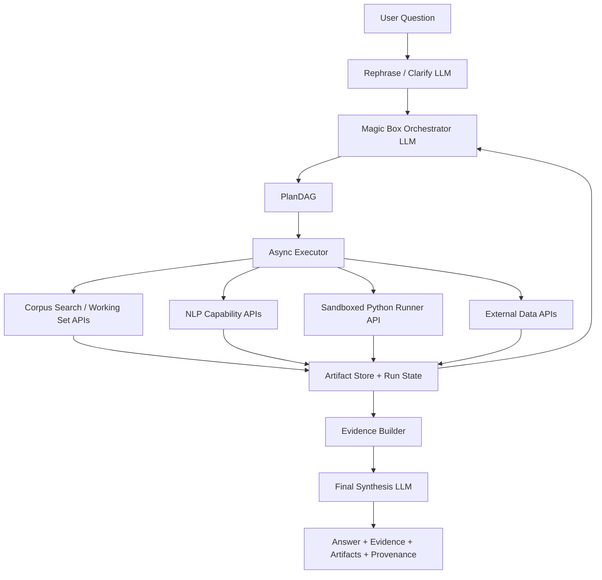

# CorpusAgent2 Magic Box Findings and First-Trial Prompt

## 1. Bottom line

The right direction is **not**:

- a rigid upfront `QuestionSpec` gate that fixes the whole workflow before the system has seen any evidence
- a pure GPT loop that improvises everything and is impossible to audit
- sending every document through an LLM

The right direction is:

- a **stateful orchestrator LLM** that understands the question, requests clarification only when needed, makes bounded assumptions when useful, and emits a **PlanDAG**
- a **capability-first tool layer** exposed as local APIs
- a **retrieval-backed working set** so the LLM only sees top-k evidence and aggregated artifacts
- **provenance, evidence tables, and validation** as first-class outputs

This stays close to the original CorpusAgent idea, but fixes its weakest parts:

- too much free-form LLM control
- mocked analytics
- weak tool modularity
- unsafe local code generation patterns

## 2. What CorpusAgent1 actually does

From the upstream repo and pipeline code, the original system is a lightweight LLM-driven loop over a large corpus:

- OpenSearch retrieves article ids from the full corpus.
- Postgres stores a temporary per-run working set and run metadata.
- The LLM performs a corpus-compatibility check, retrieval planning, NLP planning, document selection, year-level summarization, and final synthesis.
- The Streamlit UI exposes chat, debug traces, and an LLM-generated visualization playground.
- Several analytics are still mocked rather than truly executed.

What is worth keeping from CorpusAgent1:

- retrieval first, then work on a much smaller subset
- temporary per-run storage in the database
- an LLM planner that can decide what to do next
- explicit debug traces and run inspection
- evidence-aware output, at least in spirit

What should not be copied as-is:

- one big pipeline file doing too many roles
- mocked NLP outputs as if they were real analytics
- LLM logic spread across many ad hoc prompts without one consistent runtime state
- direct LLM-written visualization/code flow without a proper sandbox boundary

## 3. What the current CorpusAgent2 code already gives you

The current `corpusagent2` tree is stronger than CorpusAgent1 in some core backend pieces:

- good retrieval backbone
- provenance capture
- artifact loading and offline precompute mindset
- capability registry shape
- manifest and executor concepts

But it is currently **too deterministic** for your professor's target:

- it assumes an upfront spec and a mostly fixed planner
- it is closer to a typed pipeline engine than to a flexible analytical agent
- it lacks the API-first "toolbox" feeling of the original CorpusAgent idea
- it still does not expose the missing hard-question capabilities you actually need

So the recommendation is:

- **keep** the execution/provenance/runtime spine
- **replace** the rigid front-end planner with a stateful orchestrator loop
- **upgrade** provider adapters into real API-backed capability services

## 4. The magic box, defined precisely

The magic box is a **stateful orchestration LLM**.

It is responsible for:

- understanding the user's question
- deciding whether clarification is needed
- deciding whether assumptions are acceptable
- choosing which capabilities to run next
- deciding which outputs need evidence tables, charts, or only prose
- reacting to tool failure by retrying, replanning, or using a safe fallback
- producing the final grounded answer from intermediate artifacts

It is **not** responsible for:

- reading every document
- computing NLP/statistics itself
- directly touching the local file system
- executing arbitrary code inside the main app

The magic box should only emit structured runtime decisions such as:

- `clarify`
- `assume_and_continue`
- `plan`
- `replan_after_error`
- `final_answer`
- `reject`

## 5. Control philosophy

This is the design balance that makes the system defensible:

- The LLM is flexible at the **planning and synthesis** edges.
- The executor is deterministic in the **tool execution** middle.
- Retrieval and metadata checks are used to keep the LLM honest.

That means:

- **no rigid QuestionSpec gate as the primary contract**
- **no fully unbounded ReAct-style loop either**
- instead: a bounded agent loop with state, tool schemas, retries, and provenance

## 6. Target architecture



## 7. Runtime state

The orchestrator should not rely on long free-form chat memory alone. It should receive a compact run state on every step.

Recommended run state shape:

```json
{
  "run_id": "uuid",
  "user_question": "Which media predicted the outbreak of the Ukraine war in 2022?",
  "clarification_rounds": [
    {
      "question": "Do you mean explicit predictions before the invasion date?",
      "answer": "Yes, immediately before the war."
    }
  ],
  "assumptions": [
    "Prediction means explicit pre-invasion warning, not vague geopolitical concern."
  ],
  "corpus_schema": {
    "fields": ["doc_id", "title", "body", "date", "outlet", "author", "source_domain"]
  },
  "available_capabilities": ["db_search", "ner", "extract_keyterms", "claim_span_extract"],
  "completed_nodes": [],
  "artifacts": [],
  "tool_failures": [],
  "budget": {
    "llm_calls_used": 2,
    "llm_calls_remaining": 8
  }
}
```

## 8. Planner output contract

The orchestrator should emit a **PlanDAG**, not a prose plan.

Recommended minimal schema:

```json
{
  "action": "plan",
  "clarification_needed": false,
  "assumptions": [
    "Focus on explicit pre-invasion articles before February 24, 2022."
  ],
  "output_preferences": {
    "needs_evidence_table": true,
    "needs_plot": false,
    "needs_ranked_rows": true
  },
  "nodes": [
    {
      "id": "n1",
      "capability": "db_search",
      "inputs": {
        "query": "Ukraine invasion prediction troop buildup imminent attack",
        "filters": {"date_to": "2022-02-23"}
      },
      "depends_on": []
    },
    {
      "id": "n2",
      "capability": "claim_span_extract",
      "inputs": {"doc_ids_from": "n1"},
      "depends_on": ["n1"]
    },
    {
      "id": "n3",
      "capability": "claim_strength_score",
      "inputs": {"spans_from": "n2"},
      "depends_on": ["n2"]
    },
    {
      "id": "n4",
      "capability": "build_evidence_table",
      "inputs": {"doc_ids_from": "n1", "spans_from": "n2", "scores_from": "n3"},
      "depends_on": ["n1", "n2", "n3"]
    }
  ]
}
```

## 9. Clarification and assumption policy

These rules should come directly from the professor discussion:

- Ask a clarification only when it **materially changes workflow or output**.
- Prefer at most **two clarification rounds**.
- After that, move to **assume_and_continue**.
- Support a user override like **force answer**.
- Never try to infer hidden motives such as "why a journalist wanted X".
- Keep questions focused on observable signals in the corpus.

Examples:

- Good clarification: "Do you mean transfer-market value, media sentiment, or brand value?"
- Bad clarification: "Why did the journalist write this way?"

## 10. Final NLP capability API list

The tooling list you gave is usable, but only after deduplication. Several capabilities are duplicated across libraries, and a few critical ones are missing.

### 10.1 Duplicate capability areas

These appear in multiple libraries and should be exposed once by capability name:

- tokenization
- sentence splitting
- POS tagging
- lemmatization
- dependency parsing
- NER
- topic modeling
- embeddings/similarity
- sentiment/classification

### 10.2 Final capability-first API catalog

#### Core annotation

- `lang_id`
- `clean_normalize`
- `tokenize`
- `sentence_split`
- `mwt_expand`
- `pos_morph`
- `lemmatize`
- `dependency_parse`
- `noun_chunks`
- `ner`
- `entity_link` (optional, requires KB)

#### Extraction and corpus analytics

- `extract_ngrams`
- `extract_acronyms`
- `extract_keyterms`
- `extract_svo_triples`
- `topic_model`
- `readability_stats`
- `lexical_diversity`

#### Embeddings and similarity

- `word_embeddings`
- `doc_embeddings`
- `similarity_pairwise`
- `similarity_index`

#### Classification

- `sentiment`
- `text_classify`

### 10.3 Missing capabilities required by your benchmark questions

These are **not** covered well enough by the base library list and must be added as explicit APIs:

- `burst_detect`
- `claim_span_extract`
- `claim_strength_score`
- `quote_extract`
- `quote_attribute`
- `time_series_aggregate`
- `change_point_detect`
- `build_evidence_table`
- `plot_artifact`
- `join_external_series`

### 10.4 Recommended backend order

- `tokenize`: spaCy -> Stanza -> NLTK
- `sentence_split`: spaCy -> Stanza -> NLTK
- `pos_morph`: spaCy -> Stanza -> Flair -> NLTK
- `lemmatize`: spaCy -> Stanza -> TextBlob
- `dependency_parse`: spaCy -> Stanza
- `ner`: spaCy -> Stanza -> Flair
- `extract_ngrams`: textacy -> NLTK
- `topic_model`: textacy -> gensim
- `word_embeddings`: gensim -> Flair -> spaCy vectors
- `doc_embeddings`: gensim -> Flair -> spaCy vectors
- `similarity_pairwise`: spaCy -> gensim
- `sentiment`: Flair -> TextBlob
- `text_classify`: Flair -> spaCy -> TextBlob

## 11. Dependency audit against the current repo

The current `pyproject.toml` does **not** yet include several libraries from the target tooling set.

Missing or not yet wired as first-class dependencies:

- `textacy`
- `stanza`
- `nltk`
- `gensim`
- `flair`
- `textblob`
- `fastapi`
- `uvicorn`
- `docker` or another container-control client if the app will launch sandbox containers itself
- `opensearch-py` if you want parity with CorpusAgent1's OpenSearch path

So the right first-trial prompt must assume:

- local-first development
- capability interfaces first
- some capabilities may initially be stubs or wrappers around existing repo logic

## 12. Safe local-first execution

You said local first is acceptable, but later the same design should run in a VM on the ZHAW server. The safe answer is:

- keep all heavy tools behind internal APIs
- run the browser/web UI against the API only
- keep corpus/data access server-side
- isolate code execution in a dedicated sandbox service

### Minimum sandbox baseline

Use Docker-based isolation for the first trial:

- `--network none`
- `--read-only`
- `--tmpfs /tmp`
- `--tmpfs /run`
- non-root user
- seccomp default or stricter profile
- CPU/memory/time limits

### Harder isolation later

- gVisor if you want stronger container sandboxing
- Firecracker if you want microVM-grade isolation later

### Security rule

The main app must **never** execute LLM-generated code directly. Only the sandbox service may run it.

## 13. Web application recommendation

For a first trial, do **not** make Streamlit the main target again.

Recommended stack:

- FastAPI backend
- lightweight web frontend
- good options: React, Next.js, or a simpler HTMX frontend if you want faster progress

Why:

- API-first fits your tool architecture
- safer separation of concerns
- easier VM deployment
- easier later move toward MLOps/service deployment

## 14. Evidence policy

The system should decide when evidence is required, but some classes should force it.

Always force evidence tables for:

- prediction questions
- verification questions
- ranking questions
- comparative claims with concrete stated differences

Evidence row schema:

```json
{
  "doc_id": "12345",
  "outlet": "NZZ",
  "date": "2022-02-12",
  "excerpt": "Western officials warned that a Russian invasion could be imminent...",
  "score": 0.91
}
```

For the Ukraine benchmark, the output should explicitly favor:

- pre-invasion date filter
- one row per relevant article
- short excerpt showing the predictive statement

## 15. Research-backed inspirations

These are the strongest reference points for the new architecture:

- **CorpusAgent repo**: baseline shape for retrieval + tool use + UI  
  <https://github.com/mocatex/corpus-agent>
- **ReAct**: interleaving reasoning and actions  
  <https://arxiv.org/abs/2210.03629>
- **Toolformer**: models deciding when and how to call tools  
  <https://arxiv.org/abs/2302.04761>
- **PAL**: let the model generate programs but offload execution to a runtime  
  <https://arxiv.org/abs/2211.10435>
- **MRKL Systems**: modular neuro-symbolic architecture with external tools  
  <https://arxiv.org/abs/2205.00445>
- **LangGraph docs**: stateful graph-based agent orchestration  
  <https://docs.langchain.com/oss/python/langgraph>
- **OpenAI structured outputs/function calling**: constrained tool arguments and schema adherence  
  <https://help.openai.com/en/articles/8555517-function-calling-updates>
- **LiteLLM**: unified OpenAI-compatible model gateway for later provider swaps  
  <https://docs.litellm.ai/>
- **Docker none network driver**  
  <https://docs.docker.com/engine/network/drivers/none/>
- **Docker read-only container run**  
  <https://docs.docker.com/reference/cli/docker/container/run>
- **Docker tmpfs mounts**  
  <https://docs.docker.com/engine/storage/tmpfs/>
- **Docker seccomp**  
  <https://docs.docker.com/engine/security/seccomp/>
- **Docker rootless mode**  
  <https://docs.docker.com/engine/security/rootless/>
- **gVisor**  
  <https://gvisor.dev/docs>
- **Firecracker**  
  <https://github.com/firecracker-microvm/firecracker>
- **OWASP Top 10, injection category**  
  <https://owasp.org/index.php/Category%3AOWASP_Top_Ten_Project>

## 16. First-trial implementation scope

The first trial should be narrow but real.

Recommended first-trial benchmark coverage:

- Q1 noun distribution in football reports
- Q2 entity dominance in climate coverage over time
- Q7 Ukraine prediction evidence table

Why this set:

- it covers descriptive analysis
- it covers temporal aggregation
- it covers evidence-first verification style output
- it forces a real evidence builder

## 17. What to keep and what to refactor in corpusagent2

### Keep

- retrieval asset loading
- dense + lexical retrieval backbone
- provenance model
- run manifest idea
- offline precompute separation
- capability registry idea

### Refactor hard

- downgrade `QuestionSpec` from hard runtime gate to optional internal memory artifact
- replace the current fixed planner with a stateful orchestrator loop
- convert provider adapters into capability APIs callable by an executor
- add async parallel execution
- add sandboxed python runner service
- add evidence builder and explicit excerpt extraction
- add quote/claim/time-series APIs

## 18. Codex system prompt for the first trial

```text
You are Codex implementing a CorpusAgent-style analytical QA framework on large corpora.

Goal:
- Solve complex questions with minimal LLM calls.
- Never send all documents through an LLM.
- Use the LLM mainly for question understanding, bounded planning, replanning on failure, and final synthesis.
- All NLP and analytics must run through capability APIs backed by local libraries or sandboxed code.
- Everything must run locally first, but the architecture must be deployable to a VM without depending on a user's local filesystem from the browser.

Core design:
- Keep CorpusAgent-style flexible planning.
- Do NOT use a rigid upfront QuestionSpec gate as the main runtime controller.
- Do NOT let the LLM freestyle the entire execution loop without structure.
- Use a stateful orchestrator LLM that emits structured PlanDAG actions and receives compact run state after each step.

LLM runtime roles:
1. Rephrase / clarify when needed.
2. Emit a PlanDAG over capabilities.
3. Replan after tool failures or missing evidence.
4. Produce the final grounded answer from artifacts and evidence.

Clarification policy:
- Ask a clarification only when ambiguity materially changes workflow, evidence requirements, or need for external data.
- Maximum two clarification rounds.
- After that, continue with explicit assumptions.
- Support a force-answer mode.
- Never infer hidden motives like "why a journalist wanted X"; focus on observable corpus evidence.

Model abstraction:
- Add an LLM provider adapter so the system can run behind an OpenAI-compatible endpoint.
- Keep it easy to switch later from free/open provider endpoints to OpenAI.
- Prefer a gateway abstraction such as LiteLLM or an equivalent provider adapter layer.

Capability-first tool registry:
- Register tools by capability name, not by library name.
- Each capability may have multiple backends with priority order and a shared schema.

Implement these capability APIs:

Core annotation:
- lang_id (textacy)
- clean_normalize (textacy)
- tokenize (spaCy primary; fallback Stanza; fallback NLTK)
- sentence_split (spaCy primary; fallback Stanza; fallback NLTK)
- mwt_expand (Stanza)
- pos_morph (spaCy primary; fallback Stanza; fallback Flair; fallback NLTK)
- lemmatize (spaCy primary; fallback Stanza; fallback TextBlob)
- dependency_parse (spaCy primary; fallback Stanza)
- noun_chunks (spaCy/textacy)
- ner (spaCy primary; fallback Stanza; fallback Flair)
- entity_link (spaCy, optional if no KB is configured)

Extraction / analytics:
- extract_ngrams (textacy primary; fallback NLTK)
- extract_acronyms (textacy)
- extract_keyterms (textacy)
- extract_svo_triples (textacy)
- topic_model (textacy primary; fallback gensim)
- readability_stats (textacy)
- lexical_diversity (textacy)

Embeddings / similarity:
- word_embeddings (gensim primary; fallback Flair; fallback spaCy vectors)
- doc_embeddings (gensim primary; fallback Flair; fallback spaCy vectors)
- similarity_pairwise (spaCy primary; fallback gensim)
- similarity_index (gensim)

Classification:
- sentiment (Flair primary; fallback TextBlob)
- text_classify (Flair primary; fallback spaCy; fallback TextBlob)

Missing capabilities required by benchmark questions:
- burst_detect
- claim_span_extract
- claim_strength_score
- quote_extract
- quote_attribute
- time_series_aggregate
- change_point_detect
- build_evidence_table
- plot_artifact
- join_external_series

Tool API boundaries:
- db_search_api: corpus retrieval, filters, creation of a per-run working set
- python_runner_api: sandboxed execution only, never direct subprocess execution in the main app
- nlp capability APIs: each capability callable independently
- external_data_api: optional structured data joins
- plot_api: build chart artifacts

Sandbox requirements:
- Implement python_runner as a separate local service.
- Minimum isolation: Docker container per run with --network none, --read-only, tmpfs for /tmp and /run, non-root user, CPU/memory/time limits.
- Main application must never run LLM-generated code directly.
- If later stronger isolation is needed, leave an abstraction point for gVisor or Firecracker.

Planner output:
- The planner must emit a PlanDAG:
  {
    "action": "plan",
    "clarification_needed": false,
    "assumptions": [],
    "output_preferences": {...},
    "nodes": [
      {"id": "n1", "capability": "...", "inputs": {...}, "depends_on": []}
    ]
  }
- The executor must support parallel execution of independent nodes.

Executor:
- Build a PlanDAG executor with asyncio parallelism.
- Update run state after every node.
- Retry failed tools once.
- If a tool still fails, ask the orchestrator to replan.
- If a required capability is missing, allow fallback to sandboxed python code generation when reasonable.

Evidence and provenance:
- Implement EvidenceBuilder:
  build_evidence(question, doc_ids, candidate_spans) -> rows with {doc_id, outlet, date, excerpt, score}
- For verification and prediction questions, always return an evidence table.
- Persist a RunManifest JSON containing:
  - user question
  - clarifications and assumptions
  - plan DAG
  - tool calls and outputs
  - selected docs
  - generated artifacts
  - evidence table
  - final answer inputs
  - final answer

Interface:
- Implement a FastAPI backend first.
- Provide one main POST endpoint such as /query that returns:
  {
    "answer": "...",
    "evidence": [...],
    "artifacts": [...],
    "provenance": {...}
  }
- Do not use argparse. Put demo entry points under if __name__ == "__main__": blocks.

First-trial deliverables:
- capability-first ToolRegistry
- orchestrator module
- PlanDAG executor with asyncio parallelism
- db_search_api
- sandboxed python_runner_api
- core NLP capability adapters
- EvidenceBuilder
- RunManifest persistence
- FastAPI server
- minimal working pipeline for:
  - Q1 noun distribution
  - Q2 entity trends over time
  - Q7 prediction evidence table for Ukraine pre-invasion articles

Keep:
- provenance and validation
- retrieval-first architecture
- corpus working set idea

Do not:
- hard-gate everything through a fixed upfront QuestionSpec runtime
- make the planner fully deterministic
- let the LLM read the whole corpus
- skip evidence for strong factual claims
- execute generated code inside the main process
```

## 19. Final verdict

The strongest version of CorpusAgent2 is:

- generic
- retrieval-first
- capability-based
- LLM-orchestrated but bounded
- evidence-aware
- provenance-rich
- safe enough to run locally first and later on a VM

The current repo already contains enough of the backend spine to support this shift. What it does **not** yet contain is the actual magic box runtime, the missing hard-question capability APIs, or the sandbox boundary required to make LLM-generated analytics safe.
