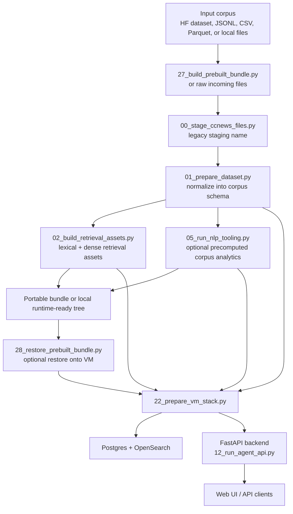
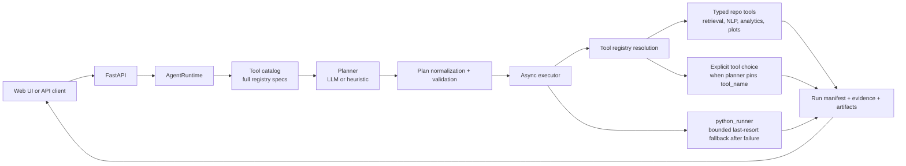

# Repo Workflow

Detailed script-to-script map: [docs/script_relationships.md](./script_relationships.md)

CorpusAgent2 should be read as a corpus agent over a user-provided corpus. That corpus can be news, law, policy, reports, or any other text collection that can be normalized into the repo schema: `doc_id`, `title`, `text`, `published_at`, `source`. Several script names still say `ccnews`; those are legacy names, not hard domain limits.

## Corpus Lifecycle



## Query Runtime



## Main Tool Surface

- Retrieval and corpus access: `db_search`, `sql_query_search`, `fetch_documents`, `create_working_set`
- NLP enrichment: `lang_id`, `clean_normalize`, `tokenize`, `sentence_split`, `mwt_expand`, `pos_morph`, `lemmatize`, `dependency_parse`, `noun_chunks`, `ner`, `entity_link`
- Analysis and evidence: `extract_keyterms`, `extract_svo_triples`, `topic_model`, `readability_stats`, `lexical_diversity`, `extract_ngrams`, `extract_acronyms`, `sentiment`, `text_classify`, `word_embeddings`, `doc_embeddings`, `similarity_pairwise`, `similarity_index`, `time_series_aggregate`, `change_point_detect`, `burst_detect`, `claim_span_extract`, `claim_strength_score`, `quote_extract`, `quote_attribute`, `build_evidence_table`, `join_external_series`
- Output and fallback helpers: `plot_artifact`, `python_runner`

## Corpus-Neutral Contract

- The corpus domain is defined by the data you ingest and the questions you ask, not by the repo name or the current example datasets.
- `01_prepare_dataset.py` is the schema boundary: once a corpus is normalized there, the downstream retrieval, storage, runtime, and deployment scripts treat it as generic corpus data.
- `27_build_prebuilt_bundle.py` is the easiest way to preprocess a large corpus elsewhere, zip the ready-to-serve artifacts, and move them onto a VM.
- The runtime is now more open-box than before: the planner can see the full tool catalog, optionally pin a concrete `tool_name`, and fall back to `python_runner` only when typed tools are not enough.
- A few heuristics and filenames are still historically news-flavored, so the system is best described as corpus-first with some legacy naming still visible.

## Common Paths

Local corpus to local UI:

```text
00_stage_ccnews_files.py -> 01_prepare_dataset.py -> 02_build_retrieval_assets.py -> 15_start_local_stack.py
```

GPU cluster preprocessing to VM serving:

```text
slurm/run_prebuilt_bundle.sbatch -> 27_build_prebuilt_bundle.py -> download zip -> 28_restore_prebuilt_bundle.py -> 22_prepare_vm_stack.py --skip-provider-assets --start-api
```

Example cluster run with a Hugging Face corpus:

```bash
sbatch /home/$USER/corpusagent2/slurm/run_prebuilt_bundle.sbatch \
  --hf-dataset stanford-oval/ccnews \
  --hf-config 2024 \
  --hf-split train \
  --hf-streaming \
  --hf-filter language=en
```

Example cluster run with a local law/policy file:

```bash
sbatch /home/$USER/corpusagent2/slurm/run_prebuilt_bundle.sbatch \
  --source-file /path/to/law_corpus.parquet
```
