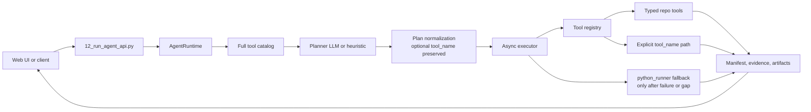

# Script Relationships

This is the script-centric map of the repo: which scripts work together, what they produce, and where they sit in the larger corpus-agent workflow.

CorpusAgent2 should be understood as a corpus agent over a normalized corpus, not as a news-only system. Some script names still contain `ccnews` or `news`; that is legacy naming from the original example corpus and does not define the architecture boundary.

## How To Read The Numbering

- `00` to `05`: corpus intake, normalization, retrieval assets, evaluation, and precomputed NLP artifacts
- `06` to `08`: packaged experiments, MCP exposure, and retrieval inspection
- `09` to `11`, `21`, `26`: Postgres, pgvector, and OpenSearch ingestion/indexing
- `12` to `16`: API, frontend config, local serving, and config inspection
- `17` to `19`: provider assets and CUDA-capable environment setup
- `20`: planner and executor provenance probing
- `22` to `24`: VM bootstrap, tunnels, and persistent service setup
- `25`: standalone corpus slice analysis
- `27` to `28`: cluster-side portable bundle build and VM-side restore

## Script Orchestration Workflow

```mermaid
flowchart TB
    subgraph Intake["Corpus Intake And Normalization"]
        DL[00_1_downlaod.py\nlegacy CC-News downloader]
        RAW[data/raw/incoming/*\nor 27 source inputs]
        STAGE[00_stage_ccnews_files.py\nlegacy staging name]
        PREP[01_prepare_dataset.py\nnormalize into corpus schema]
        DEEP[25_analyze_news_corpus.py\nstandalone corpus slice analysis]

        DL --> STAGE
        RAW --> STAGE
        STAGE --> PREP
        PREP --> DEEP
    end

    subgraph Assets["Retrieval Assets, Evaluation, And Framework Runs"]
        ASSETS[02_build_retrieval_assets.py\nlexical + dense assets]
        EVR[03_evaluate_retrieval.py\nnDCG / MRR / Recall]
        EVF[04_evaluate_faithfulness.py\nclaim-level faithfulness eval]
        NLP[05_run_nlp_tooling.py\nprecomputed corpus analytics]
        FRAME[06_run_framework.py\npackaged workload runner]
        REVIEW[08_review_retrieval.py\nretrieval inspection and backtests]

        PREP --> ASSETS
        PREP --> NLP
        ASSETS --> EVR
        ASSETS --> EVF
        ASSETS --> FRAME
        NLP --> FRAME
        ASSETS --> REVIEW
    end

    subgraph Storage["Database And Search Infrastructure"]
        PGINIT[09_init_postgres_schema.py]
        PGING[10_ingest_parquet_to_postgres.py]
        PGBACK[26_backfill_pgvector_embeddings.py]
        PGINDEX[11_build_pgvector_index.py]
        OSIDX[21_bulk_index_opensearch.py]

        PREP --> PGING
        PGINIT --> PGING
        PGING --> PGBACK
        PGBACK --> PGINDEX
        PREP --> OSIDX
    end

    subgraph Serving["Serving, Runtime, Frontend, And Probing"]
        MCP[07_mcp_server.py\nMCP server]
        API[12_run_agent_api.py\nFastAPI runtime]
        FCFG[13_write_frontend_config.py\nwrite web/config.js]
        FRONT[14_run_static_frontend.py\nserve web UI]
        STACK[15_start_local_stack.py\nlocal convenience wrapper]
        CFG[16_print_effective_config.py\nresolved config + health]
        PROBE[20_capability_provenance_probe.py\nplanner/executor provenance]

        STACK --> FCFG
        STACK --> API
        STACK --> FRONT
        API --> PROBE
        API --> MCP
    end

    subgraph Deploy["Environment, VM, And Transfer"]
        PROV[17_download_provider_assets.py]
        CUDAOK[18_verify_cuda118_env.py]
        CUDASH[19_rebuild_env_cuda118.sh or .ps1]
        VM[22_prepare_vm_stack.py\nmain deployment orchestrator]
        TUNNEL[23_start_cloudflared_tunnel.py]
        SRV[24_configure_vm_services.py]
        BOOT[scripts/bootstrap_ubuntu_vm.sh]
        BUNDLE[27_build_prebuilt_bundle.py\nportable prebuilt corpus bundle]
        RESTORE[28_restore_prebuilt_bundle.py]
        SBBUNDLE[slurm/run_prebuilt_bundle.sbatch]

        CUDASH --> PROV
        CUDASH --> CUDAOK
        BOOT --> VM
        VM --> PROV
        VM --> STAGE
        VM --> PREP
        VM --> ASSETS
        VM --> PGINIT
        VM --> PGING
        VM --> PGBACK
        VM --> PGINDEX
        VM --> OSIDX
        VM --> FCFG
        VM --> API
        TUNNEL --> API
        SRV --> FCFG
        SRV --> API
        SRV --> TUNNEL
        SBBUNDLE --> BUNDLE
        BUNDLE --> RESTORE
        RESTORE --> VM
    end
```



## Runtime Decision Workflow



## What Each Group Is For

- Intake scripts turn raw files or HF rows into the common corpus schema.
- Asset scripts build the retrieval layer and optional precomputed analytics the runtime can reuse.
- Storage scripts move the normalized corpus into Postgres, pgvector, and OpenSearch for larger deployments.
- Serving scripts expose the agent through FastAPI, the static UI, or MCP.
- Deployment scripts make the same repo runnable on a VM or on a GPU cluster with a prebuilt transfer bundle.

## Key Artifacts And Directories

| Path | Produced by | Used by |
| --- | --- | --- |
| `data/raw/incoming/` | manual input, `00_1_downlaod.py`, `27_build_prebuilt_bundle.py` | `00_stage_ccnews_files.py` |
| `data/raw/ccnews_staged/` | `00_stage_ccnews_files.py` | `01_prepare_dataset.py` |
| `data/processed/documents.parquet` | `01_prepare_dataset.py` | `02_build_retrieval_assets.py`, `10_ingest_parquet_to_postgres.py`, `21_bulk_index_opensearch.py`, `25_analyze_news_corpus.py` |
| `data/indices/lexical/*` | `02_build_retrieval_assets.py` | retrieval runtime, `03_evaluate_retrieval.py`, `08_review_retrieval.py` |
| `data/indices/dense/*` | `02_build_retrieval_assets.py` | retrieval runtime, `03_evaluate_retrieval.py`, `10_ingest_parquet_to_postgres.py`, `26_backfill_pgvector_embeddings.py` |
| `data/indices/doc_metadata.parquet` | `02_build_retrieval_assets.py` | runtime, evaluation, and review |
| `outputs/nlp_tools/*` | `05_run_nlp_tooling.py` | runtime reuse, `06_run_framework.py`, bundle/VM flow |
| `outputs/retrieval_eval/*` | `03_evaluate_retrieval.py` | evaluation review/reporting |
| `outputs/faithfulness_eval/*` | `04_evaluate_faithfulness.py` | evaluation review/reporting |
| `outputs/postgres/*` | `09`, `10`, `11`, `26` | deployment diagnostics |
| `outputs/opensearch/*` | `21_bulk_index_opensearch.py` | deployment diagnostics |
| `outputs/agent_runtime/*` | `12_run_agent_api.py` runtime queries | UI run inspection and artifacts |
| `outputs/prebuilt/*` | `27_build_prebuilt_bundle.py` | `28_restore_prebuilt_bundle.py`, VM transfer |

## Entry Points By Goal

| Goal | Normal entry point | What it wraps |
| --- | --- | --- |
| Build a local corpus from raw files | `00 -> 01 -> 02` | staging, normalization, retrieval assets |
| Add precomputed corpus analytics | `05_run_nlp_tooling.py` | sentiment/entity/topic/time-slice artifacts |
| Evaluate retrieval quality | `03_evaluate_retrieval.py` | retrieval metrics over gold queries |
| Evaluate answer faithfulness | `04_evaluate_faithfulness.py` | NLI-style support checks over gold claims |
| Run API + frontend locally | `15_start_local_stack.py` | `13_write_frontend_config.py`, `12_run_agent_api.py`, `14_run_static_frontend.py` |
| Run backend only | `12_run_agent_api.py` | FastAPI runtime only |
| Bootstrap a VM end-to-end | `22_prepare_vm_stack.py` | environment, assets, Docker services, indexes, frontend config, optional API start |
| Preprocess on a GPU cluster and move to VM | `slurm/run_prebuilt_bundle.sbatch` -> `27_build_prebuilt_bundle.py` | cluster preprocessing + portable zip |
| Restore preprocessed corpus artifacts on VM | `28_restore_prebuilt_bundle.py` | unzip into repo so VM bootstrap can skip slow prep |

## Script Reference

| Script | Main job | Main inputs | Main outputs | Works with |
| --- | --- | --- | --- | --- |
| `00_1_downlaod.py` | Download the original example `cc_news` dataset directly into raw incoming | hard-coded HF dataset id | `data/raw/incoming/cc_news.jsonl.gz` | legacy quick-start path |
| `00_stage_ccnews_files.py` | Copy raw corpus files into a clean staged area and write a summary manifest | `data/raw/incoming/` | `data/raw/ccnews_staged/`, stage summary JSON | `01_prepare_dataset.py`, Slurm prep, VM bootstrap, bundle build |
| `01_prepare_dataset.py` | Normalize staged rows into the repo corpus schema | staged raw files | `data/processed/documents.parquet`, summary JSON | `02`, `10`, `21`, `25`, `27` |
| `02_build_retrieval_assets.py` | Build lexical and optional dense retrieval assets plus metadata parquet | `data/processed/documents.parquet` | `data/indices/lexical/*`, `data/indices/dense/*`, `data/indices/doc_metadata.parquet` | runtime, evaluation, bundle flow |
| `03_evaluate_retrieval.py` | Score retrieval quality with `nDCG`, `MRR`, `Recall`, bootstrap CI, paired tests | retrieval assets + gold query file | `outputs/retrieval_eval/*` | Slurm evaluation |
| `04_evaluate_faithfulness.py` | Score claim support / faithfulness against gold claims | claim file + corpus metadata | `outputs/faithfulness_eval/*` | Slurm evaluation |
| `05_run_nlp_tooling.py` | Precompute corpus-level NLP artifacts such as sentiment/entity/topic time series | processed documents + granularity config | `outputs/nlp_tools/*` | runtime reuse, `06`, bundle flow |
| `06_run_framework.py` | Run the framework workload file over the prepared corpus | workload file + corpus assets | framework output directory | usually paired with `05` |
| `07_mcp_server.py` | Expose the runtime as an MCP server over stdio | repo runtime/config | long-running MCP process | editor/tool integrations |
| `08_review_retrieval.py` | Inspect retrieval payloads or backtest them against gold queries | retrieval output JSON/JSONL, gold queries, assets | `outputs/retrieval_audit/*` | complements `03` |
| `09_init_postgres_schema.py` | Create pgvector extension, corpus table, and helper indexes | Postgres DSN env | Postgres init summary | `10`, `22` |
| `10_ingest_parquet_to_postgres.py` | Upsert normalized corpus documents into Postgres | `data/processed/documents.parquet`, optional dense assets | Postgres ingest summary | `09`, `26`, `22` |
| `11_build_pgvector_index.py` | Build ANN indexes in Postgres for dense retrieval | populated Postgres corpus table | Postgres index summary | `26`, `22` |
| `12_run_agent_api.py` | Start the FastAPI backend and corpus-agent runtime | config, retrieval assets, optional Postgres/OpenSearch | live API server | `15`, `22`, `23`, `24` |
| `13_write_frontend_config.py` | Write runtime config into `web/config.js` | app config + env overrides | `web/config.js` | `14`, `15`, `22`, `24` |
| `14_run_static_frontend.py` | Serve the static `web/` frontend locally | `web/` and generated config | live frontend server | `15` |
| `15_start_local_stack.py` | Convenience launcher for backend + frontend together | repo config | starts `12`, writes config with `13`, starts `14` | local development |
| `16_print_effective_config.py` | Print resolved config and retrieval health for debugging | config + env | stdout JSON | preflight before `12`, `15`, `22` |
| `17_download_provider_assets.py` | Download external NLP assets for spaCy, stanza, NLTK, TextBlob | active Python env | provider model/data files | `19`, `22` |
| `18_verify_cuda118_env.py` | Check whether the CUDA-capable environment is usable | active Python env | stdout GPU/module report | `19` |
| `19_rebuild_env_cuda118.sh` / `.ps1` | Rebuild the virtualenv for CUDA 11.8 and verify it | repo + `uv` | fresh `.venv`, requirements, provider assets | `17`, `18` |
| `20_capability_provenance_probe.py` | Run representative queries and print planner/tool provenance | local runtime + example queries | stdout provenance summaries | debugging runtime behavior |
| `21_bulk_index_opensearch.py` | Create the OpenSearch index and bulk-load the normalized corpus | processed documents + OpenSearch config | OpenSearch index summary | `22` |
| `22_prepare_vm_stack.py` | Main bootstrap/orchestration script for VM deployment | env, repo, optional raw data or restored bundle | full stack setup, summaries, optional API start | wraps most deployment scripts |
| `23_start_cloudflared_tunnel.py` | Start a quick Cloudflare tunnel for the local backend | running API | public tunnel URL in stdout | demos/tests, `24` |
| `24_configure_vm_services.py` | Install reboot-safe `systemd` services for API and optional tunnel | VM host with sudo/systemd | service files + enabled services | `13`, `12`, `23` |
| `25_analyze_news_corpus.py` | Run a standalone deep-dive analysis for a selected corpus slice | processed corpus parquet | analysis JSON/parquet outputs in custom dir | separate from agent runtime |
| `26_backfill_pgvector_embeddings.py` | Fill Postgres `dense_embedding` values from local dense assets or on-the-fly encoding | Postgres rows + optional dense assets | Postgres backfill summary | `10`, `11`, `22` |
| `27_build_prebuilt_bundle.py` | Build a VM-ready portable bundle from a HF corpus or local files | HF dataset or source file(s) | `outputs/prebuilt/*.zip`, bundle manifest | `slurm/run_prebuilt_bundle.sbatch`, `28` |
| `28_restore_prebuilt_bundle.py` | Restore the portable bundle into the repo tree on the VM | bundle zip from `27` | restored `data/processed`, `data/indices`, optional `outputs/nlp_tools` | `22` |
| `bootstrap_ubuntu_vm.sh` | Thin Ubuntu wrapper around VM bootstrap | repo path / shell env | calls `22_prepare_vm_stack.py` | quick VM setup |

## Slurm Wrappers

| Slurm script | What it runs |
| --- | --- |
| `slurm/run_prepare.sbatch` | `00_stage_ccnews_files.py` -> `01_prepare_dataset.py` |
| `slurm/run_build_assets.sbatch` | `02_build_retrieval_assets.py` |
| `slurm/run_evaluation.sbatch` | `03_evaluate_retrieval.py` -> `04_evaluate_faithfulness.py` |
| `slurm/run_framework.sbatch` | `05_run_nlp_tooling.py` -> `06_run_framework.py` |
| `slurm/run_prebuilt_bundle.sbatch` | `27_build_prebuilt_bundle.py --clean-existing ...` |

## Most Common Real Workflows

### 1. Local corpus plus local UI

```text
00_stage_ccnews_files.py -> 01_prepare_dataset.py -> 02_build_retrieval_assets.py -> 15_start_local_stack.py
```

### 2. Local corpus plus precomputed analytics

```text
00_stage_ccnews_files.py -> 01_prepare_dataset.py -> 02_build_retrieval_assets.py -> 05_run_nlp_tooling.py -> 12_run_agent_api.py
```

### 3. Postgres plus pgvector hybrid retrieval

```text
09_init_postgres_schema.py -> 10_ingest_parquet_to_postgres.py -> 26_backfill_pgvector_embeddings.py -> 11_build_pgvector_index.py -> 12_run_agent_api.py
```

### 4. OpenSearch plus VM deployment

```text
22_prepare_vm_stack.py
```

### 5. GPU cluster preprocessing plus VM serving

```text
slurm/run_prebuilt_bundle.sbatch -> 27_build_prebuilt_bundle.py -> download zip -> 28_restore_prebuilt_bundle.py -> 22_prepare_vm_stack.py
```

## Practical Notes

- `01_prepare_dataset.py` is the main schema boundary. If your corpus can be normalized there, the rest of the stack treats it as generic corpus data.
- `22_prepare_vm_stack.py` is the densest script because it is an orchestrator that wraps many other scripts.
- `15_start_local_stack.py` is only a convenience wrapper; the real serving logic lives in `12`, `13`, and `14`.
- `27` and `28` are the cleanest path when preprocessing is too slow on the VM.
- `00_1_downlaod.py`, `00_stage_ccnews_files.py`, and `25_analyze_news_corpus.py` keep their historical names, but the broader pipeline is not restricted to news as a domain.
